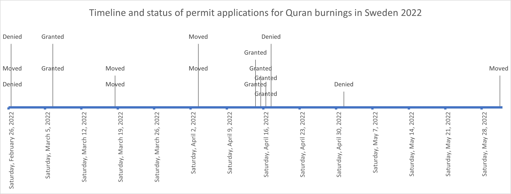

---
output:
  html_document: 
    keep_md: true
  output: github_document
author: "Juta and Jeff"
date: "2024-10-31"
title: "Explaining the Easter Riots in Sweden"
bibliography: references.bib
---

```{r setup, include=FALSE}
knitr::opts_chunk$set(echo = TRUE)
```

## Introduction

Rioting constitutes a special class of criminal activity which often signals a breakdown of trust in state authorities. While the legal definition of a riot varies across countries and over time @wilkinson2009, its illegality positions it as a special type of crime that is a signifier of a break down in social cohesion that is often overlooked especially in quantitative research. In the spring of 2022, several Swedish neighborhoods experienced riots, and the reasons for why the rioting occured in some areas and not in others is not yet well understood.

Researching the causes of riots has been of interest to government agencies and academics alike across decades ( @cantle, @chicagocommissiononracerelations1922, etc). In his review of the literature @newburn2021 notes that historically the focus was on studying the crowds and how they were thought to have power over individuals, who give themselves over to irrational behaviors they would normally not engage in. This developed into structuralist approaches that were the product of studies analyzing the social justice movements of the 20th century that erupted in violent riots. These approaches focused on how strain, both real and perceived, should result in public uprisings that can (and in some cases should) result in violence. More contemporarly, researchers have increasingly expressed interest in mechanistic explanations of riots, that include the push factors (structural, political and cultural grievances and conflicts or group violence), as well as pull factors (situational and interactional aspects) of how the state behaves that can provoke violent outbursts. A useful theoretical model that integrates these different overlapping factors for researchers attempting to explain why a riot occurs in a specific time and place, as opposed to another, is the so-called 'flash-points' model @king2005 . Despite its usefulness, the flash-points approach does not specify the necessary and sufficient conditions to produce a riot, we attempt to assess this using the case of the Easter riots in Sweden in 2022.

## Background: The case of Sweden

The Easter riots were significant in Sweden in terms of the scale of the violence and how widespread they were. As many as 300 police officers were injured, <!--# this number is from Swedish Wikipedia --> many police vehicles were sabotaged or destroyed, and several civilians were reported injured. The riots were widely covered in Swedish media, with many criticizing how the police handled the event which resulted in several independent investigations of the incident (@bergqvist2022; @holgersson2023; @justitieutskottetsbetänkande2022). This event occurred against the backdrop of rising cultural and political tensions in the country over crime and immigration with both mainstream and radical right parties increasingly turning to securatization of public spaces and law and order rhetoric @lehmann that centered surveillance and increased presence of police (as opposed to universalist welfare state programs, see @garland2001 <!-- After riots: Toward a research agenda on the long-term effects of urban unrest. -->) as the tools of choice to prevent and combat crime. As an example of this, the Swedish police ordered a classification scheme to be created with the intended purpose of reducing crime by funneling resources and programs to areas they deemed to be vulnerable to gang related crime (@purr2019). This vulnerable areas program also received criticism, both on principle and for its design, since research has shown that there was considerable subjectivity in determining which areas ended up on this list, showing that the ethic composition of a neighborhood, not crime, most strongly predicted receiving a designation (@gerell2022). This, combined with recent research investigating racial profiling and high profile incidents of abuse by security guards which both erode trust in the police (@bolkvadze2024; @wästerfors2020), meant that the relationship between the police and the communities they are policing was a subject of social concern. <!-- # https://www.diva-portal.org/smash/get/diva2:1648043/FULLTEXT01.pdf According to Linn J Sandberg one factor which helped prevent rioting was cooperation with religious communities but broader cooperation with the civil society also has a positive effect  -->

It was at this time, in 2022, that Rasmus Paludan, a radical right-wing Danish-born activist began staging political demonstrations in Sweden where he would burn the Quran in public. This provocative act was a part of a larger movement that occurred predominantly in Scandinavia and received the most media attention in Sweden (@nissen), sparking a heated public debate about free speech culminating with one predominant Swedish academic calling for a ban on the burning all books @nyberg2023, sacred or not.

It is also clear that the police played an important role in shaping how the demonstrations took place. In the Swedish context, a permit is needed in order to conduct a political demonstration and the police used discretion in deciding how and when to grant permits for the Quran burning demonstrations. The timeline below shows that beginning in February 2022 the police either denied or moved three demonstrations on the same day. Then they began either granting permits or moving the planned demonstrations. This culminated in April, the month of Ramadan, when the police granted a flurry of five demonstrations at the same time without moving them, these permits coincide with the riot events of interest in this study <!--# according to holgersson this was because of a court decision -->. Afterward, they denied two permits and moved one demonstration location. The use of this discretion, a midst a heated public debate, put the police in the position of being a central actor in the conflict between Paludan and those that sought to protest his actions. However, one report suggests that denying Paludan a permit to burn the Quran, or moving his demonstration may have actually *increased* the likelihood of violence. Basing this claim on the number of people arrested, @bergqvist note (pg 32) that when Paludan was present he drew the attention of the counter demonstrators and when he was absent, the police became the primary target of the counter-demonstrators.

{width="627"}

## Flash-points in Sweden

This Swedish case presents an interesting lens through which to apply the flash-points model. First, the recent dynamics offer analytical advantages for operationalizing some of the concepts included in the model in ways that were not amenable to quantitative studies in other contexts. Second, data availability allow for relatively fine grained analysis (DeSo units) and access to information about the 'pull' factors including insight into how the police were managing the Quran burnings, as well as institutionalized stigmatization though the designation the 'vulnerable areas list'.

The flash-points model consists of six inter dependent elements, or levels of analysis, that sometimes overlap: *structural*, *political/ideological*, *cultural*, *contextual*, *situational* and *interactional* @waddington2010. As @newburn2021 summarizes the model:

> 'ranging from the macro to the micro and including the structural (the material circumstances of different social groups, their relationship with the state, and how such factors relate to conflict), political/ideological (the relationship between dissenting groups to political and ideological institutions and how they are treated by those institutions), cultural (different social groups’ understandings of the social world and their place in it), contextual (the long-term and more immediate backdrop to relationships— for example, between particular groups and the police—within which disorder occurs), situational (the spatial and social determinants of disorder), and interactional (the dynamics of interaction between police and protestors). It is at this latter level that flashpoints (single or multiple) are found.' (pg 61).

Structural, political, and cultural elements encapsulate what have been referred to as push factors @wilkinson2009. Pinning down which factors linked to material deprivation, or its distinct variant relative deprivation have been elusive in research on riots. In fact, several studies have found there to be no relationship between riot prevalence and deprivation across U.S. cities (see for example @olzak1996), or within cities in case studies @bergesen1998. However, more recent evidence from the UK @kawalerowicz2015, studying the origins of individual rioters show that rioters do come from economically disadvantaged areas. In the Swedish context, structural issues such as segregation and economic disadvantage measured as proportions of people on social welfare assistance have been linked to increased urban unrest @malmberg2013, providing at least some level of evidence for the claim that material deprivation is relevant in the analysis of riots. While segregation can be considered a structural element in the flash-points framework because it is an indicator of political power and social inclusion,  this also overlaps with the political/ideological element concerns the relationships that between dissenting groups and how they are treated by institutions of power.


Violence at the highest when protest was called off (suprising?). Denying permits, police seen as an actor, police symbolic for contention. 


***\<!--# We continue along these lines, discussing how the other elements in the model have been researched, and if there is a Swedish example. Then we discuss which indicators we have in our analysis that we consider to be indicators of each element. My thoughts:***

***Structural: unemployment rates, and segregation***
While structural factors are often not a sufficient conditions for a riot to start, poverty and socio-economic exclusion provide a fertile ground for the rhetoric that accompanies riots, making violence more justifiable (Myers 2025). Over the last 20 years Sweden has experience large riots in 2013 and 2008, but they were more local in character. Behind these events is a larger process which Sernhede et al. (2016) call the slow dismantling of the Swedish welfare state. 


some statis of housing stock, jerzy sarnecki and ethnic undercalss work. 


Stating in in the 1990s, this process included privatization and marketization of the public sector, most notably the privatization of the public housing stocks. Swedish cities are among the most segregated in Europe, for example in a comparative study of 5 European capitals Stockholm together with Brussels had the highest levels of economic segregation (Haandrikman et al. 2023). 


re-regulations to support the privatization and marketization of the
public sector;
• responsibilization—citizens remade as customers and co-producers;
• new forms of disciplinary power, such as increased surveillance and
new strategies for policing urban protest;
• new forms of governance, including public-private partnerships; and
• a move from full employment to ‘standby-ability’.


Behind the urban uprising that set Stockholm on fi re lies another,
albeit less visible, revolution: the slow and deliberate dismantling of the
Swedish welfare state. Th e neoliberal ideology underlying this shift had
already begun to inspire the leadership of the Social Democratic Party in
the 1980s, in its failing attempts to fi nd ways out of the 1970s economic
crisis (Larsson, Letell, & Th örn, 2012 ). Not until after the national fi nancial
crisis of 1990–1993 were neoliberal policies introduced full-scale by
the new centre-right government, which announced a major welfare rollback
program legitimized by a rhetoric of ‘Th e Only Way’ and a ‘System
Shift’, and by the government-leading Conservative Party re-naming
itself the New Labour Party. Th e editors of the book Transformations of
the Swedish Welfare State summarize the elements of Sweden’s neoliberal
shift as follows (Th örn & Larsson, 2012 ):

**Political / ideological: Segregation and political climate (which we don't measure), but I can make a figure from the manifesto project about the change in law and order rhetoric over time if we think that helps**

*Explaint the general feeling about immigration. 

Question of political representation
Overtime, Swedish political discourse has also shifted to the right when it comes to immigration or law and order.  

**Cultural: Maybe trust in the police?**

trust in police and police - mention this and add in the model and municipal level. 
interaction low level of trust in police and high level truct in police. 


Do we have any measure of this? 
**Contextual: Vulnerable areas list**


**Situational: The permit management**

**Interactional: Whatever was happening on the ground, there are testimonials in the reports I reference, I believe that we can bring in if we want --\>**


## Discussion 

Mention that this is a very contentious issue, death of the other guy who burned Quran. 


## References
