Explaining the Easter Riots in Sweden
================
Juta
12 March, 2025

## Riot-related crimes overtimes

See the list of riot-related crimes where we have:

- Cars burned
- Arson
- Violence against police offices (both light and heavy)
- Police sabotage
- Rioting

We start by reading it the data and examining the patterns overtime.

### Cars burned

Data recorded between 2010 and 2024 but the number of events remains
largely flat until 2019 when they shot to above 100 recorded crimes each
month.

``` r
bilbrand<-read.csv("crime_data/bilbrand brott.csv")

glimpse(bilbrand)
```

    ## Rows: 10,950
    ## Columns: 10
    ## $ X                  <int> 1, 2, 3, 4, 5, 6, 7, 8, 9, 10, 11, 12, 13, 14, 15, …
    ## $ Id                 <int> 2165, 2167, 3151, 3333, 3410, 3517, 7084, 8604, 860…
    ## $ Brottskod          <int> 1211, 1211, 1211, 1211, 1211, 1211, 1211, 1211, 121…
    ## $ Brottskod.klartext <chr> "Skadegörelse, bilbrand eller brand på annat motorf…
    ## $ Inskrivningsdatum  <chr> "2022-01-01", "2022-01-01", "2022-04-17", "2022-04-…
    ## $ Brottsdatum        <chr> "2022-01-01", "2022-01-01", "2022-04-17", "2022-04-…
    ## $ Kommun             <chr> "Norrköping", "Norrköping", "Norrköping", "Norrköpi…
    ## $ Län                <chr> "Östergötlands Län", "Östergötlands Län", "Östergöt…
    ## $ DeSO.område        <chr> "0581C1070", "0581C1070", "0581C1020", "", "0581C10…
    ## $ Antal              <int> 1, 1, 1, 1, 1, 1, 1, 1, 1, 1, 1, 1, 1, 1, 1, 1, 1, …

``` r
#create monthly sums
bilbrand.month <- bilbrand %>%  
  #extract year and month
  mutate(new_date = (substr(Brottsdatum, 1, 7))) %>%
  group_by(new_date) %>%
  summarise(Freq = sum(Antal))

bilbrand.month$new_date <- as.Date(paste0(bilbrand.month$new_date, "-01"))


ggplot(bilbrand.month, aes(x = new_date, y = Freq)) +
  geom_line() +
  geom_point() +
  scale_x_date(date_breaks = "1 year",
               date_labels = "%Y") +
  geom_vline(xintercept = as.Date("2022-04-01"),
             linetype = 2, color = 2, linewidth = 1) +
  xlab("Month") +
  ylab("Events") +
  theme_bw()
```

<!-- -->

Would be good to figure out why there are no car burnings recorded for
earlier years. One possibility is that they were recorded under a
different crime category?

> In Swedish statistics, car burnings (as long as the crime does not
> endanger the lives of others) are reported by the National Council for
> Crime Prevention (BRÅ) under the category: vandalism and aggravated
> criminal damage, subcategory damage by fire (Malmberg, Andersson and
> Östh, 2013)

### Police sabotage

Data starts in 2019 and ends in 2024.

``` r
blaljussabotage<-read.csv("crime_data/blåljus sabotage brott.csv")

glimpse(blaljussabotage)
```

    ## Rows: 2,155
    ## Columns: 10
    ## $ X                  <int> 1, 2, 3, 4, 5, 6, 7, 8, 9, 10, 11, 12, 13, 14, 15, …
    ## $ Id                 <int> 1144, 2437, 3424, 3426, 3449, 3450, 3451, 3938, 461…
    ## $ Brottskod          <int> 1311, 1311, 1311, 1311, 1311, 1311, 1311, 1311, 131…
    ## $ Brottskod.klartext <chr> "Sabotage mot blåljusverksamhet inkl. grovt", "Sabo…
    ## $ Inskrivningsdatum  <chr> "2021-06-19", "2022-02-26", "2022-04-14", "2022-04-…
    ## $ Brottsdatum        <chr> "2021-06-18", "2022-02-26", "2022-04-14", "2022-04-…
    ## $ Kommun             <chr> "Ånge", "Håbo", "Norrköping", "Norrköping", "Malmö"…
    ## $ Län                <chr> "Västernorrlands Län", "Uppsala Län", "Östergötland…
    ## $ DeSO.område        <chr> "2260C1010", "0305C1040", "0581C1030", "0581C1030",…
    ## $ Antal              <int> 1, 1, 1, 1, 1, 1, 1, 1, 1, 1, 1, 1, 1, 1, 1, 1, 1, …

``` r
sabotage.month <- blaljussabotage %>%  
  mutate(new_date = (substr(Brottsdatum, 1, 7))) %>%
  group_by(new_date) %>%
  summarise(Freq = sum(Antal))

sabotage.month$new_date <- as.Date(paste0(sabotage.month$new_date, "-01"))

ggplot(sabotage.month, aes(x = new_date, y = Freq))+
  geom_line() +
  geom_point() +
  scale_x_date(date_breaks = "1 year",
               date_labels = "%Y") +
  geom_vline(xintercept = as.Date("2022-04-01"),
             linetype = 2, color = 2, linewidth = 1) +
  xlab("Month") +
  ylab("Events") +
  theme_bw()
```

<!-- -->

### Arson

Data starts in 2000 and ends in 2024. Similar to car burnings the data
is largely flat until 2019.

``` r
brand<-read.csv("crime_data/brand brott.csv")

glimpse(brand)
```

    ## Rows: 14,804
    ## Columns: 10
    ## $ X                  <int> 1, 2, 3, 4, 5, 6, 7, 8, 9, 10, 11, 12, 13, 14, 15, …
    ## $ Id                 <int> 3827, 4486, 5732, 6231, 6462, 6472, 7890, 10172, 11…
    ## $ Brottskod          <int> 1210, 1210, 1210, 1210, 1210, 1210, 1210, 1210, 121…
    ## $ Brottskod.klartext <chr> "Skadegörelse, genom brand (ej på motorfordon)", "S…
    ## $ Inskrivningsdatum  <chr> "2022-05-01", "2022-05-04", "2022-07-19", "2022-08-…
    ## $ Brottsdatum        <chr> "2022-04-30", "2022-05-03", "2022-01-29", "2022-07-…
    ## $ Kommun             <chr> "Sollefteå", "Bjurholm", "Karlshamn", "Linköping", …
    ## $ Län                <chr> "Västernorrlands Län", "Västerbottens Län", "Blekin…
    ## $ DeSO.område        <chr> "2283A0040", "2403A0010", "1082C1060", "0580C1550",…
    ## $ Antal              <int> 1, 1, 1, 1, 1, 1, 1, 1, 1, 1, 1, 1, 1, 1, 1, 1, 1, …

``` r
brand.month <- brand %>%  
  mutate(new_date = (substr(Brottsdatum, 1, 7))) %>%
  group_by(new_date) %>%
  summarise(Freq = sum(Antal))

brand.month$new_date <- as.Date(paste(brand.month$new_date, "-01", sep=""))

ggplot(brand.month, aes(x = new_date, y = Freq))+
  geom_line() +
  geom_point() +
  scale_x_date(date_breaks = "2 years",
               date_labels = "%Y") +
  geom_vline(xintercept = as.Date("2022-04-01"),
             linetype = 2, color = 2, linewidth = 1) +
  xlab("Month") + 
  ylab("Events") +
  theme_bw()
```

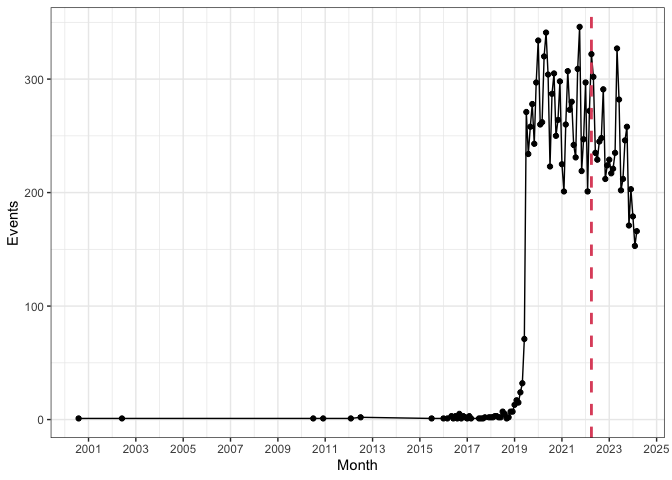<!-- -->

### Violence against police officers

Violence which does not result in inability to work for more than 24
hours. Data starts in 2010 and ends in 2024.

``` r
vald1<-read.csv("crime_data/våld mot polis 1 brott.csv")

glimpse(vald1)
```

    ## Rows: 5,256
    ## Columns: 10
    ## $ X                  <int> 1, 2, 3, 4, 5, 6, 7, 8, 9, 10, 11, 12, 13, 14, 15, …
    ## $ Id                 <int> 344, 981, 1851, 1853, 1854, 1958, 2208, 2277, 2441,…
    ## $ Brottskod          <int> 1701, 1701, 1701, 1701, 1701, 1701, 1701, 1701, 170…
    ## $ Brottskod.klartext <chr> "Våld mot tjänsteman, mot polisman om våldet beräkn…
    ## $ Inskrivningsdatum  <chr> "2020-03-14", "2021-04-10", "2021-11-13", "2021-11-…
    ## $ Brottsdatum        <chr> "2020-03-14", "2021-04-10", "2021-11-13", "2021-11-…
    ## $ Kommun             <chr> "Örebro", "Örebro", "Västerås", "Västerås", "Väster…
    ## $ Län                <chr> "Örebro Län", "Örebro Län", "Västmanlands Län", "Vä…
    ## $ DeSO.område        <chr> "1880C1650", "1880C1620", "1980C1130", "1980C1130",…
    ## $ Antal              <int> 1, 1, 1, 1, 1, 1, 1, 1, 1, 1, 1, 1, 1, 1, 1, 1, 1, …

``` r
vald1.month <- vald1 %>%  
  mutate(new_date = (substr(Brottsdatum, 1, 7))) %>%
  group_by(new_date) %>%
  summarise(Freq = sum(Antal))

vald1.month$new_date <- as.Date(paste(vald1.month$new_date, "-01", sep=""))

ggplot(vald1.month, aes(x = new_date, y = Freq))+
  geom_line() +
  geom_point() +
  scale_x_date(date_breaks = "1 year",
               date_labels = "%Y") +
  geom_vline(xintercept = as.Date("2022-04-01"),
             linetype = 2, color = 2, linewidth = 1) +
  xlab("Month") + 
  ylab("Events") +
  theme_bw()
```

<!-- -->

### Violence against police officers

Violence which does result in inability to work for more than 24 hours.
Data starts in 2017 and ends in 2024.

``` r
vald2<-read.csv("crime_data/våld mot polis 2 brott.csv")

glimpse(vald2)
```

    ## Rows: 1,055
    ## Columns: 10
    ## $ X                  <int> 1, 2, 3, 4, 5, 6, 7, 8, 9, 10, 11, 12, 13, 14, 15, …
    ## $ Id                 <int> 1185, 1782, 1800, 2679, 3428, 3851, 3995, 4014, 401…
    ## $ Brottskod          <int> 1702, 1702, 1702, 1702, 1702, 1702, 1702, 1702, 170…
    ## $ Brottskod.klartext <chr> "Våld mot tjänsteman, mot polisman om våldet beräkn…
    ## $ Inskrivningsdatum  <chr> "2021-07-11", "2021-11-16", "2021-11-13", "2022-03-…
    ## $ Brottsdatum        <chr> "2021-07-11", "2021-11-16", "2021-11-13", "2022-03-…
    ## $ Kommun             <chr> "Ljusnarsberg", "Huddinge", "Stockholm", "Öckerö", …
    ## $ Län                <chr> "Örebro Län", "Stockholms Län", "Stockholms Län", "…
    ## $ DeSO.område        <chr> "1864A0010", "0126C1510", "0180C2150", "1407C1040",…
    ## $ Antal              <int> 1, 1, 1, 1, 1, 1, 1, 1, 1, 1, 1, 1, 1, 1, 1, 1, 1, …

``` r
vald2.month <- vald2 %>%  
  mutate(new_date = (substr(Brottsdatum, 1, 7))) %>%
  group_by(new_date) %>%
  summarise(Freq = sum(Antal))

vald2.month$new_date <- as.Date(paste(vald2.month$new_date, "-01", sep=""))

ggplot(vald2.month, aes(x = new_date, y = Freq))+
  geom_line() +
  geom_point() +
  scale_x_date(date_breaks = "1 year",
               date_labels = "%Y") +
  geom_vline(xintercept = as.Date("2022-04-01"),
             linetype = 2, color = 2, linewidth = 1) +
  xlab("Month") + 
  ylab("Events") +
  theme_bw()
```

<!-- -->

Combine two types of violence against police crimes

``` r
vald<-bind_rows(vald1, vald2)

vald.month <- vald %>%  
  mutate(new_date = (substr(Brottsdatum, 1, 7))) %>%
  group_by(new_date) %>%
  summarise(Freq = sum(Antal))

vald.month$new_date <- as.Date(paste(vald.month$new_date, "-01", sep=""))

ggplot(vald.month, aes(x = new_date, y = Freq))+
  geom_line() +
  geom_point() +
  scale_x_date(date_breaks = "1 year",
               date_labels = "%Y") +
  geom_vline(xintercept = as.Date("2022-04-01"),
             linetype = 2, color = 2, linewidth = 1) +
  xlab("Month") + 
  ylab("Events") +
  theme_bw()
```

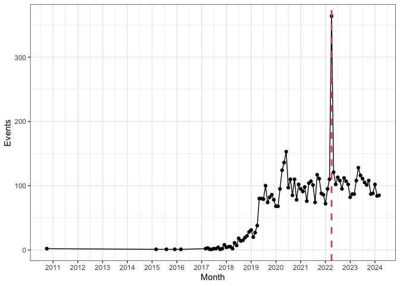<!-- -->

### Riots

Data starts in 2020 and ends in 2024.

``` r
upplopp<-read.csv("crime_data/upplopp brott.csv")

upplopp.month <- upplopp %>%  
  mutate(new_date = (substr(Brottsdatum, 1, 7))) %>%
  group_by(new_date) %>%
  summarise(Freq = sum(Antal))

upplopp.month$new_date <- as.Date(paste(upplopp.month$new_date, "-01", sep=""))

ggplot(upplopp.month, aes(x = new_date, y = Freq))+
  geom_line() +
  geom_point() +
  scale_x_date(date_breaks = "1 year",
               date_labels = "%Y") +
  geom_vline(xintercept = as.Date("2022-04-01"),
             linetype = 2, color = 2, linewidth = 1) +
  xlab("Month")+ #change axis lables
  ylab("Events") +
  theme_bw()
```

<!-- -->

After inspecting time trends it seems that a common point to start
looking at the data is 2020.

``` r
bilbrand.month <- bilbrand.month %>%
  filter(new_date >= as.Date("2020-01-01"))
sabotage.month <- sabotage.month %>%
  filter(new_date >= as.Date("2020-01-01"))
brand.month <- brand.month %>%
  filter(new_date >= as.Date("2020-01-01"))
vald.month <- vald.month %>%
  filter(new_date >= as.Date("2020-01-01"))
upplopp.month <- upplopp.month %>%
  filter(new_date >= as.Date("2020-01-01"))

data.month <- bilbrand.month %>%
  left_join(sabotage.month, by = c("new_date")) %>%
  left_join(brand.month, by = c("new_date")) %>%
  left_join(vald.month, by = c("new_date")) %>%
  left_join(upplopp.month, by = c("new_date")) %>%
  mutate(across(2:6, ~replace_na(., 0)))

data.month <- data.month %>%
  rename(bilbrand = names(.)[2], sabotage = names(.)[3], brand = names(.)[4], vald = names(.)[5], upplopp = names(.)[6])

data.month_long <- melt(data.month, id = "new_date") 

ggplot(data.month_long, aes(x = new_date, y = value, color = variable)) +  
  geom_line() +
  geom_point() + 
  scale_x_date(date_breaks = "1 year",
               date_labels = "%Y") +
  geom_vline(xintercept = as.Date("2022-04-01"),
             linetype = 2, color = 2, linewidth = 1) +
  xlab("Month")+
  ylab("Events") +
  scale_color_manual(name="Type", values = c("#1f77b4", "#ff7f0e", "#2ca02c", "#9467bd", "#d62728"), 
                     labels = c("Bilbrand", "Blåljus sabotage", "Brand", "Våld", "Upplop")) +
  theme_bw()
```

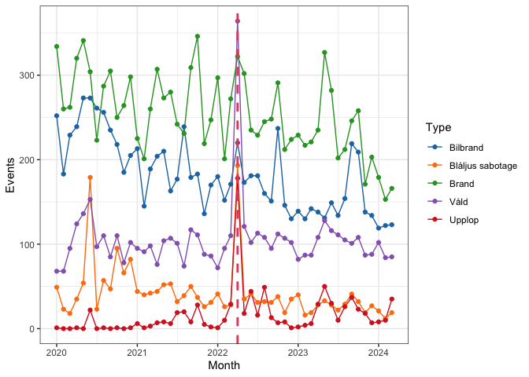<!-- --> One potential issue is
that we don’t know how this measures rioting and at some point it would
be good to cross check geographical distribution of rioting measured
with recorded crimes with newspaper coverage. Also it looks like the
best crimes for capturing 2022 rioting are: upplop, våld and blåljus
sabotage.

## Rates for crimes in 2022

Now let’s look at which area had highest rates of rioting in 2022 for
each of these crime categories.

``` r
#read in shapefile for DeSo and utsatta områden
deso <- st_read("boundaries/deso_2018_2021-10-21/DeSO_2018_v2.gpkg")
```

    ## Reading layer `DeSO_2018_v2' from data source 
    ##   `/Users/jutakawalerowicz/Library/Mobile Documents/com~apple~CloudDocs/testGithub/2022-Sweden-riots/boundaries/deso_2018_2021-10-21/DeSO_2018_v2.gpkg' 
    ##   using driver `GPKG'
    ## Simple feature collection with 5984 features and 7 fields
    ## Geometry type: POLYGON
    ## Dimension:     XY
    ## Bounding box:  xmin: 266646.3 ymin: 6132476 xmax: 920877.4 ymax: 7671055
    ## Projected CRS: SWEREF99 TM

``` r
areas <- st_read("boundaries/uso_2023_shp/uso_2023.shp")
```

    ## Reading layer `uso_2023' from data source 
    ##   `/Users/jutakawalerowicz/Library/Mobile Documents/com~apple~CloudDocs/testGithub/2022-Sweden-riots/boundaries/uso_2023_shp/uso_2023.shp' 
    ##   using driver `ESRI Shapefile'
    ## Simple feature collection with 59 features and 13 fields
    ## Geometry type: MULTIPOLYGON
    ## Dimension:     XY, XYZ
    ## Bounding box:  xmin: 314008.9 ymin: 6158706 xmax: 685936.2 ymax: 6706842
    ## z_range:       zmin: 0 zmax: 0
    ## Projected CRS: SWEREF99 TM

``` r
areas <- st_zm(areas)

#read in data with population for DeSo 
pop <- read_excel("deso_data/000005FC_20240806-102837.xlsx",
                  skip=2)[,c(-1)]
```

    ## New names:
    ## • `` -> `...1`
    ## • `` -> `...2`

``` r
pop <- pop %>% 
  rename_with(~c("deso", "total"))

# Filter crime data and calculate frequency then join with population data and calculate rates

calculate_rates <- function(crime_data) 
  {crime_sum <- crime_data %>%
  filter(substr(!!sym("Brottsdatum"), 1, 4) == "2022") %>%
  rename("deso" = !!sym("DeSO.område")) %>%
  group_by(deso) %>%
  summarise(Freq = sum(Antal))
  
#potential problem some DeSo have higher turnover rates
crime_sum_with_rate <- pop %>% 
  left_join(crime_sum, by = "deso") %>% 
  mutate(Freq = replace_na(Freq, 0)) %>% 
  mutate(Rate = Freq / !!sym("total") * 1000)

deso_crime <- deso %>% 
  left_join(crime_sum_with_rate)

  return(deso_crime)
}

bilbrand_sum_with_rate <- calculate_rates(crime_data = bilbrand)
```

    ## Joining with `by = join_by(deso)`

``` r
sabotage_sum_with_rate <- calculate_rates(crime_data = blaljussabotage)
```

    ## Joining with `by = join_by(deso)`

``` r
brand_sum_with_rate <- calculate_rates(crime_data = brand)
```

    ## Joining with `by = join_by(deso)`

``` r
vald_sum_with_rate <- calculate_rates(crime_data = vald)
```

    ## Joining with `by = join_by(deso)`

``` r
upplopp_sum_with_rate <- calculate_rates(crime_data = upplopp)
```

    ## Joining with `by = join_by(deso)`

### Maps for 3 metropolitan municipalities

Supplemented by top 10 neighborhoods (DeSO) with the highest rates

``` r
library(cowplot)

plot_kommun_maps <- function(deso_data, areas_data, kommun_ort_pairs, title, colors = "YlGnBu", label_size = 9, nrow = 2) {
  
  # Get the range for scaling
  rate_range <- range(deso_data$Rate, na.rm = TRUE)
  
  # Create the individual plots
  plot_list <- lapply(kommun_ort_pairs, function(pair) {
    kommun_code <- pair$kommun
    ort_name <- pair$ort
    
    ggplot() +
      geom_sf(data = deso_data[deso_data$kommun == kommun_code, ], aes(fill = Rate), lwd = 0.1) + 
      geom_sf(data = areas_data[areas_data$ORT == ort_name, ], colour = "red", fill = NA) +
      scale_fill_gradientn(limits = rate_range, colors = RColorBrewer::brewer.pal(4, colors)) + 
      theme_void() +
      
      theme(legend.position = 'none')
  })
  
  # Create a separate plot with a legend
  p_legend <- ggplot() +
    geom_sf(data = deso_data[deso_data$kommun == kommun_ort_pairs[[1]]$kommun, ], aes(fill = Rate), lwd = 0.1) + 
    geom_sf(data = areas_data[areas_data$ORT == kommun_ort_pairs[[1]]$ort, ], colour = "red", fill = NA) +
    scale_fill_gradientn(limits = rate_range, colors = RColorBrewer::brewer.pal(4, colors))
  
  # Add the legend to the plot list
  plot_list_with_legend <- c(plot_list, list(get_legend(p_legend)))
  
  # Create the plot grid
  plot_grid_figure <- cowplot::plot_grid(plotlist = plot_list_with_legend, 
                              labels = sapply(kommun_ort_pairs, function(x) x$ort), 
                              label_size = 9, 
                              nrow = 2)
  
  # Add a title above the grid
  title <- ggdraw() + draw_label(title, fontface = 'bold', size = 15)
  
  # Combine title and plot grid
  cowplot::plot_grid(title, plot_grid_figure, ncol = 1, rel_heights = c(0.1, 1))
}

kommun_ort_pairs <- list(
  list(kommun = "0180", ort = "Stockholm"),
  list(kommun = "1480", ort = "Göteborg"),
  list(kommun = "1280", ort = "Malmö")
)


sabotage_sum_with_rate %>%
  arrange(desc(Rate)) %>% 
  slice_head(n = 10) %>% 
  dplyr::select(deso,kommun,kommunnamn,lan,lannamn,Rate) %>% 
  st_drop_geometry()           
```

    ##         deso kommun kommunnamn lan         lannamn      Rate
    ## 1  1880C1220   1880     Örebro  18          Örebro 31.080414
    ## 2  0580C1670   0580  Linköping  05    Östergötland 22.185247
    ## 3  0580C1660   0580  Linköping  05    Östergötland  8.279669
    ## 4  1282C1170   1282 Landskrona  12           Skåne  7.874016
    ## 5  1480C4000   1480   Göteborg  14 Västra Götaland  7.338225
    ## 6  1880C1190   1880     Örebro  18          Örebro  5.275498
    ## 7  1280C1200   1280      Malmö  12           Skåne  5.106778
    ## 8  0581C1030   0581 Norrköping  05    Östergötland  3.834356
    ## 9  1480C3990   1480   Göteborg  14 Västra Götaland  3.533569
    ## 10 0180C2390   0180  Stockholm  01       Stockholm  2.414001

``` r
plot_kommun_maps(sabotage_sum_with_rate, areas, kommun_ort_pairs, title="Blåljus sabotage", colors = "YlGnBu", label_size = 9, nrow = 2)
```

    ## Warning in get_plot_component(plot, "guide-box"): Multiple components found;
    ## returning the first one. To return all, use `return_all = TRUE`.

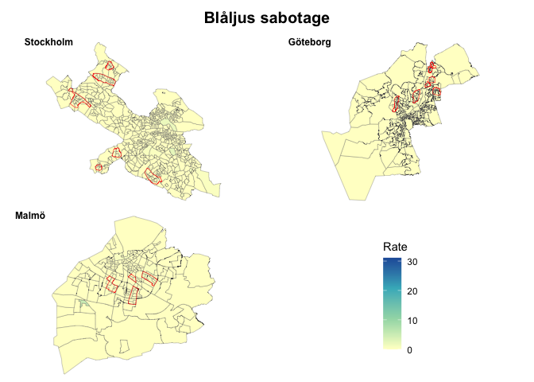<!-- -->

``` r
vald_sum_with_rate %>%
  arrange(desc(Rate)) %>% 
  slice_head(n = 10) %>% 
  dplyr::select(deso,kommun,kommunnamn,lan,lannamn,Rate) %>% 
  st_drop_geometry()           
```

    ##         deso kommun kommunnamn lan      lannamn      Rate
    ## 1  1880C1220   1880     Örebro  18       Örebro 66.600888
    ## 2  0580C1670   0580  Linköping  05 Östergötland 30.504714
    ## 3  0581C1030   0581 Norrköping  05 Östergötland 14.570552
    ## 4  1880C1190   1880     Örebro  18       Örebro 14.067995
    ## 5  0484C1270   0484 Eskilstuna  04 Södermanland  6.933333
    ## 6  0380C1870   0380    Uppsala  03      Uppsala  6.700168
    ## 7  0184C1110   0184      Solna  01    Stockholm  5.997819
    ## 8  0180C4040   0180  Stockholm  01    Stockholm  5.547850
    ## 9  0180C3480   0180  Stockholm  01    Stockholm  5.095541
    ## 10 0580C1660   0580  Linköping  05 Östergötland  5.059798

``` r
plot_kommun_maps(vald_sum_with_rate, areas, kommun_ort_pairs, title="Våld", colors = "YlGnBu", label_size = 9, nrow = 2)
```

    ## Warning in get_plot_component(plot, "guide-box"): Multiple components found;
    ## returning the first one. To return all, use `return_all = TRUE`.

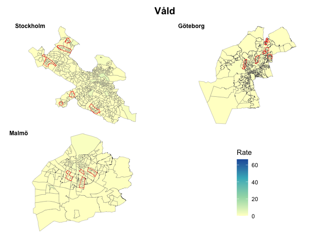<!-- -->

``` r
upplopp_sum_with_rate %>%
  arrange(desc(Rate)) %>% 
  slice_head(n = 10)  %>% 
  dplyr::select(deso,kommun,kommunnamn,lan,lannamn,Rate) %>% 
  st_drop_geometry()
```

    ##         deso kommun kommunnamn lan         lannamn      Rate
    ## 1  0180C5340   0180  Stockholm  01       Stockholm 31.979257
    ## 2  1282C1170   1282 Landskrona  12           Skåne 21.872266
    ## 3  0580C1670   0580  Linköping  05    Östergötland 19.966722
    ## 4  0184C1310   0184      Solna  01       Stockholm 13.153340
    ## 5  0180C4040   0180  Stockholm  01       Stockholm 12.944984
    ## 6  0180C4620   0180  Stockholm  01       Stockholm  9.603073
    ## 7  0180C3880   0180  Stockholm  01       Stockholm  8.615385
    ## 8  0180C3940   0180  Stockholm  01       Stockholm  8.541393
    ## 9  1480C2590   1480   Göteborg  14 Västra Götaland  7.768362
    ## 10 1480C1940   1480   Göteborg  14 Västra Götaland  5.836576

``` r
plot_kommun_maps(upplopp_sum_with_rate, areas, kommun_ort_pairs, title="Upplop", colors = "YlGnBu", label_size = 9, nrow = 2)
```

    ## Warning in get_plot_component(plot, "guide-box"): Multiple components found;
    ## returning the first one. To return all, use `return_all = TRUE`.

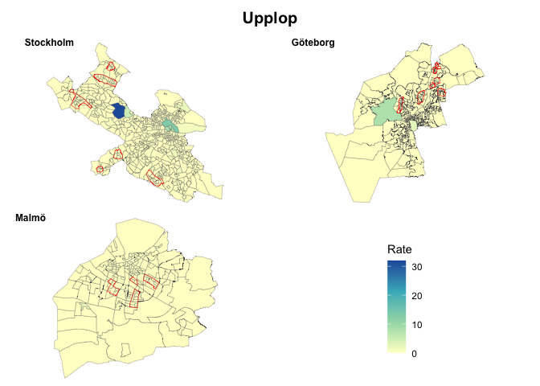<!-- -->

For blåljus sabotage the highest rates were recorded in neighbouhroods
in Örebro and Linköping, for våld in Örebro, Linköping and Norrköping
and for upplop in Stockholm, Landskrona and Linköping. Also note that
the crime rates are not so highly correlated, especially for våld and
upplopp.

``` r
sabotage_sum_with_rate_renamed <- sabotage_sum_with_rate %>%
  rename(Rate_sabotage = Rate) %>%
  rename(Freq_sabotage = Freq) %>%
  st_drop_geometry()

vald_sum_with_rate_renamed <- vald_sum_with_rate %>%
  rename(Rate_vald = Rate) %>%
  rename(Freq_vald = Freq) %>%
  st_drop_geometry()

upplopp_sum_with_rate_renamed <- upplopp_sum_with_rate %>%
  rename(Rate_upplop = Rate) %>%
  rename(Freq_upplop = Freq) %>%
  st_drop_geometry()

combined_sum_with_rate <- sabotage_sum_with_rate_renamed %>%
  full_join(vald_sum_with_rate_renamed, by = "deso") %>%  
  full_join(upplopp_sum_with_rate_renamed, by = "deso")   %>%
  dplyr::select(deso, Freq_sabotage, Rate_sabotage, Freq_vald, Rate_vald, Freq_upplop, Rate_upplop)

corr_mat = cor(combined_sum_with_rate[c("Rate_sabotage", "Rate_vald", "Rate_upplop")])
corrplot(corr_mat, method = 'number') 
```

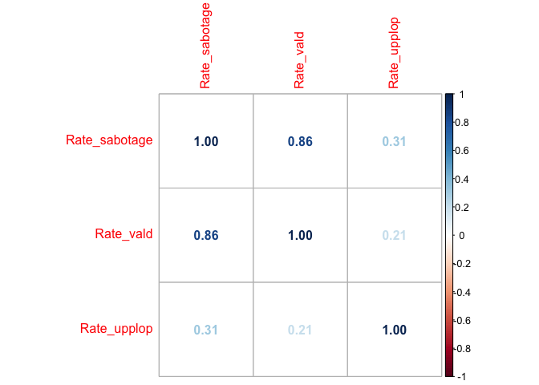<!-- -->

### Overlay and bi-variate associations

Now we need to determine which neighborhoods (DeSO) are part of the
vulnerable areas and which are not and then check if neighborhoods that
fall within vulnerable areas have higher rates of riot-related crime.
These two geographies do not overlap as shown in figure below for Malmö.
Blue lines represent boundaries of DeSo area, red lines vulnerable
areas. Highlighted in yellow are DeSOs which intersect with a vulnerable
area and are therefore considered to be part of the area. We can also
consider some more elegant methods like “at least 50% of the
neighborhood intersects with vulnerable area”.

``` r
deso <- st_read("boundaries/deso_2018_2021-10-21/DeSO_2018_v2.gpkg")
```

    ## Reading layer `DeSO_2018_v2' from data source 
    ##   `/Users/jutakawalerowicz/Library/Mobile Documents/com~apple~CloudDocs/testGithub/2022-Sweden-riots/boundaries/deso_2018_2021-10-21/DeSO_2018_v2.gpkg' 
    ##   using driver `GPKG'
    ## Simple feature collection with 5984 features and 7 fields
    ## Geometry type: POLYGON
    ## Dimension:     XY
    ## Bounding box:  xmin: 266646.3 ymin: 6132476 xmax: 920877.4 ymax: 7671055
    ## Projected CRS: SWEREF99 TM

``` r
areas <- st_read("boundaries/uso_2023_shp/uso_2023.shp")
```

    ## Reading layer `uso_2023' from data source 
    ##   `/Users/jutakawalerowicz/Library/Mobile Documents/com~apple~CloudDocs/testGithub/2022-Sweden-riots/boundaries/uso_2023_shp/uso_2023.shp' 
    ##   using driver `ESRI Shapefile'
    ## Simple feature collection with 59 features and 13 fields
    ## Geometry type: MULTIPOLYGON
    ## Dimension:     XY, XYZ
    ## Bounding box:  xmin: 314008.9 ymin: 6158706 xmax: 685936.2 ymax: 6706842
    ## z_range:       zmin: 0 zmax: 0
    ## Projected CRS: SWEREF99 TM

``` r
intersection_results<-st_intersects(deso, areas)
intersection_results.df<-as.data.frame(intersection_results)

deso$row.id<-as.numeric(row.names(deso))
deso<-left_join(deso, intersection_results.df, by="row.id")

deso <- deso %>%
  mutate(is.in=case_when(col.id>0  ~ 1,
                         is.na(col.id) ~ NA))

ggplot() +
  geom_sf(data = deso[deso$kommun=="1280",], colour = "blue", fill = NA) + 
  geom_sf(data = deso[(deso$kommun=="1280" & deso$is.in==1) ,], aes(fill = is.in), lwd = 0.1) + 
  scale_fill_gradientn(limits = range, 
                       colors = RColorBrewer::brewer.pal(4, "YlGnBu")) + 
  geom_sf(data = areas[areas$ORT=="Malmö",], colour = "red", lwd=1,  fill = NA) + 
  theme_void() +
  theme(legend.position = 'none')
```

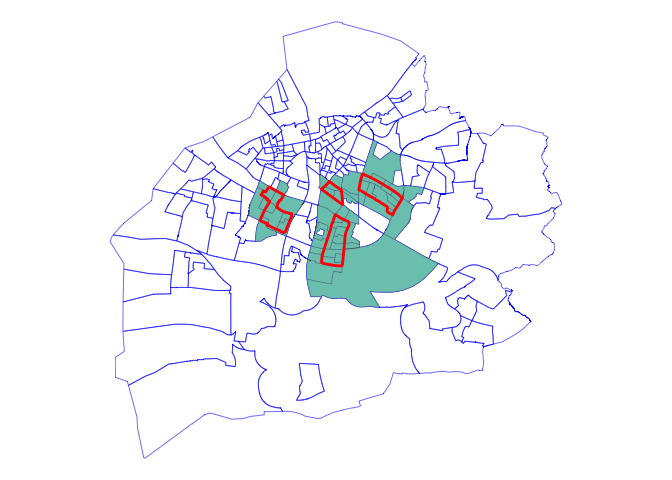<!-- -->

It looks like rates are higher for all categories of crimes. Btw, should
I add confidence intervals into the figures?

``` r
deso <- deso %>% 
  left_join(combined_sum_with_rate)
```

    ## Joining with `by = join_by(deso)`

``` r
deso <- deso %>%
  mutate(col.id = replace_na(col.id, 0)) %>% 
  mutate(col.id = ifelse(col.id > 0, 1, col.id))  


means <- deso %>% 
  group_by(col.id) %>%
  summarise(
    mean.Rate_sabotage = mean(Rate_sabotage, na.rm = TRUE),
    sd.Rate_sabotage = sd(Rate_sabotage, na.rm = TRUE),
    mean.Rate_vald = mean(Rate_vald, na.rm = TRUE),
    sd.Rate_vald = sd(Rate_vald, na.rm = TRUE),
    mean.Rate_upplop = mean(Rate_upplop, na.rm = TRUE),
    sd.Rate_upplop = sd(Rate_upplop, na.rm = TRUE), 
  )

ggplot(means) +
  geom_bar( aes(x=as.factor(col.id), y=mean.Rate_sabotage), stat="identity") +
  xlab("Vulnerable area") + ylab("Events per 1,000") +
  theme_bw() +
  ggtitle("Rate of blåljussabotage by vulnerable areas")
```

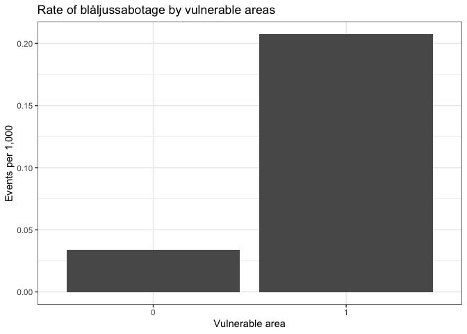<!-- -->

``` r
ggplot(means) +
  geom_bar( aes(x=as.factor(col.id), y=mean.Rate_vald), stat="identity") +
  xlab("Vulnerable area") + ylab("Events per 1,000") +
  theme_bw() +
  ggtitle("Rate of våld against police by vulnerable areas")
```

<!-- -->

``` r
ggplot(means) +
  geom_bar( aes(x=as.factor(col.id), y=mean.Rate_upplop), stat="identity") +
  xlab("Vulnerable area") + ylab("Events per 1,000") +
  theme_bw() +
  ggtitle("Rate of upplopp by vulnerable areas")
```

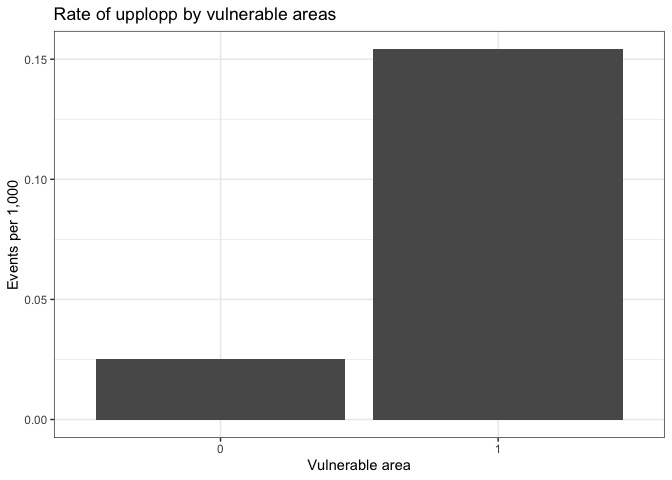<!-- -->

## Modelling

First, we read in some neighborhood data downloaded from SCBs
Statistikdatabasen and then we consider different models for count data.

#### employment

``` r
empl <- read_excel("deso_data/000007A8_20240813-151334.xlsx",
                  skip=3)
```

    ## New names:
    ## • `` -> `...1`
    ## • `totalt` -> `totalt...2`
    ## • `totalt` -> `totalt...3`
    ## • `totalt` -> `totalt...4`
    ## • `totalt` -> `totalt...5`
    ## • `totalt` -> `totalt...6`

``` r
names(empl)<-c("deso","sysselsatta","arbetslösa","arbetskraften","utanför_rbetskraften","totalt_empl")

empl <- empl %>%
  drop_na(deso | totalt_empl)
```

#### education

``` r
edu <- read_excel("deso_data/000005MO_20240813-151714.xlsx",
                   skip=3)
```

    ## New names:
    ## • `` -> `...1`

``` r
names(edu)<-c("deso","förgymnasial","gymnasial","eftergymnasial_kort","eftergymnasial_lång","saknas_edu")

edu <- edu %>%
  drop_na(deso | förgymnasial)
```

#### age

``` r
age <- read_excel("deso_data/000005FF_20240813-152010.xlsx",
                  skip=3)
```

    ## New names:
    ## • `` -> `...1`

``` r
names(age)<-c("deso", "totalt_age", "g1", "g2", "g3", "g4", "g5")

age <- age %>%
  drop_na(deso | totalt_age)
```

#### background

According to SCB foreign background is defined as persons born abroad or
born in Sweden with two foreign-born parents. Persons with swedish
background are persons born in Sweden with at least one parent born in
Sweden.

``` r
background <- read_excel("deso_data/000005FE_20240813-152154.xlsx",
                  skip=3)
```

    ## New names:
    ## • `` -> `...1`

``` r
names(background)<-c("deso", "svensk", "utländsk", "totalt_background")

background <- background %>%
  drop_na(deso | totalt_background)
```

#### family type

``` r
family <- read_excel("deso_data/000005F8_20240813-152932.xlsx",
                         skip=3)
```

    ## New names:
    ## • `` -> `...1`

``` r
names(family)<-c("deso", "s_b", "s_ub", "e_b", "e_ut", "o")

family <- family %>%
  drop_na(deso | s_b)
```

#### housing tenure

``` r
housing <- read_excel("deso_data/000006OC_20240813-153146.xlsx",
                     skip=3)
```

    ## New names:
    ## • `` -> `...1`

``` r
names(housing)<-c("deso", "hyresrätt",  "bostadsrätt",  "äganderätt",   "saknas_housing")

housing <- housing %>%
  drop_na(deso | hyresrätt)
```

#### income

``` r
income <- read_excel("deso_data/000005FM_20240813-153407.xlsx",
                      skip=2)
```

    ## New names:
    ## • `` -> `...1`

``` r
names(income)<-c("deso", "medianvärde", "medelvärde", "personer_income")

income <- income %>%
  drop_na(deso | personer_income)
```

#### economic status

``` r
status <- read_excel("deso_data/000006TA_20240813-153551.xlsx",
                     skip=2)
```

    ## New names:
    ## • `` -> `...1`

``` r
names(status)<-c("deso", "låg", "hög", "personer_status")

status <- status %>%
  drop_na(deso | personer_status)
```

#### type of estate

``` r
estates <- read_excel("deso_data/000005LO_20240813-153750.xlsx",
                     skip=3)
```

    ## New names:
    ## • `` -> `...1`

``` r
names(estates)<-c("deso","småhus","flerbostadshus","övriga","specialbostäder","saknas_estates","totalt_estates")

estates <- estates %>%
  drop_na(deso | totalt_estates)
```

#### Quran burning demos

To find where Quran buring demos took place we read in the demo file
that Jeff got from the police and focus only on 2022. I looked up
addresses and added coordinates manually in the file.

In the figure below Deso neighborhoods are in light blue and
demonstrations are red points.

``` r
demo <- read_excel("demo_data/A466.302-2024.xlsx")
```

    ## New names:
    ## • `` -> `...1`

``` r
head(demo, 18)
```

    ## # A tibble: 18 × 7
    ##     ...1 `Antal ansökningar` `Planerat datum` Plats som framgår i ansök…¹ Status
    ##    <dbl>               <dbl> <chr>            <chr>                       <chr> 
    ##  1  2022                  13 <NA>             <NA>                        <NA>  
    ##  2    NA                   1 44712            Prologgatan, Örebro         Avsla…
    ##  3    NA                   2 44682            Humlegården - Norra Bantor… Avslag
    ##  4    NA                   3 44668            Von Lingens väg 47, Malmö   Avslag
    ##  5    NA                   4 44665            Kärrköksgatan 78, Jönköping Bifall
    ##  6    NA                   5 44667            Koppargården, Landskrona    Bifall
    ##  7    NA                   6 44667            Ensjövägen, Norrköping      Bifall
    ##  8    NA                   7 44666            Epiloggatan 1, Örebro       Bifall
    ##  9    NA                   8 44665            Skäggetorps Centrum i Link… Bifall
    ## 10    NA                   9 44654            Försommarvägen 8, Växjö, a… Avsla…
    ## 11    NA                  10 44654            Koppargården, Landskrona    Avsla…
    ## 12    NA                  11 44638            Vid moskeen på Wachtmeiste… Avsla…
    ## 13    NA                  12 44638            Hermodalstorget             Avsla…
    ## 14    NA                  13 44626            Skäggetorps centrum         Bifall
    ## 15    NA                  14 44626            Ensjövägen, Norrköping      Bifall
    ## 16    NA                  15 44618            Frölunda Torg, Hjällbo Cen… Bifal…
    ## 17    NA                  16 44618            Hjällbo Centrum             Bifal…
    ## 18    NA                  17 44618            Angered Torg                Bifal…
    ## # ℹ abbreviated name: ¹​`Plats som framgår i ansökan`
    ## # ℹ 2 more variables: coord1 <dbl>, coord2 <dbl>

``` r
demo <- st_read("demo_data/A466.302-2024.shp")
```

    ## Reading layer `A466.302-2024' from data source 
    ##   `/Users/jutakawalerowicz/Library/Mobile Documents/com~apple~CloudDocs/testGithub/2022-Sweden-riots/demo_data/A466.302-2024.shp' 
    ##   using driver `ESRI Shapefile'
    ## Simple feature collection with 17 features and 6 fields
    ## Geometry type: POINT
    ## Dimension:     XY
    ## Bounding box:  xmin: 11.91304 ymin: 55.56623 xmax: 18.05458 ymax: 59.33503
    ## Geodetic CRS:  WGS 84

``` r
st_crs(demo)
```

    ## Coordinate Reference System:
    ##   User input: WGS 84 
    ##   wkt:
    ## GEOGCRS["WGS 84",
    ##     DATUM["World Geodetic System 1984",
    ##         ELLIPSOID["WGS 84",6378137,298.257223563,
    ##             LENGTHUNIT["metre",1]]],
    ##     PRIMEM["Greenwich",0,
    ##         ANGLEUNIT["degree",0.0174532925199433]],
    ##     CS[ellipsoidal,2],
    ##         AXIS["latitude",north,
    ##             ORDER[1],
    ##             ANGLEUNIT["degree",0.0174532925199433]],
    ##         AXIS["longitude",east,
    ##             ORDER[2],
    ##             ANGLEUNIT["degree",0.0174532925199433]],
    ##     ID["EPSG",4326]]

``` r
st_crs(deso)
```

    ## Coordinate Reference System:
    ##   User input: SWEREF99 TM 
    ##   wkt:
    ## PROJCRS["SWEREF99 TM",
    ##     BASEGEOGCRS["SWEREF99",
    ##         DATUM["SWEREF99",
    ##             ELLIPSOID["GRS 1980",6378137,298.257222101,
    ##                 LENGTHUNIT["metre",1]]],
    ##         PRIMEM["Greenwich",0,
    ##             ANGLEUNIT["degree",0.0174532925199433]],
    ##         ID["EPSG",4619]],
    ##     CONVERSION["SWEREF99 TM",
    ##         METHOD["Transverse Mercator",
    ##             ID["EPSG",9807]],
    ##         PARAMETER["Latitude of natural origin",0,
    ##             ANGLEUNIT["degree",0.0174532925199433],
    ##             ID["EPSG",8801]],
    ##         PARAMETER["Longitude of natural origin",15,
    ##             ANGLEUNIT["degree",0.0174532925199433],
    ##             ID["EPSG",8802]],
    ##         PARAMETER["Scale factor at natural origin",0.9996,
    ##             SCALEUNIT["unity",1],
    ##             ID["EPSG",8805]],
    ##         PARAMETER["False easting",500000,
    ##             LENGTHUNIT["metre",1],
    ##             ID["EPSG",8806]],
    ##         PARAMETER["False northing",0,
    ##             LENGTHUNIT["metre",1],
    ##             ID["EPSG",8807]]],
    ##     CS[Cartesian,2],
    ##         AXIS["northing (N)",north,
    ##             ORDER[1],
    ##             LENGTHUNIT["metre",1]],
    ##         AXIS["easting (E)",east,
    ##             ORDER[2],
    ##             LENGTHUNIT["metre",1]],
    ##     USAGE[
    ##         SCOPE["Topographic mapping (medium and small scale)."],
    ##         AREA["Sweden - onshore and offshore."],
    ##         BBOX[54.96,10.03,69.07,24.17]],
    ##     ID["EPSG",3006]]

``` r
demo_transformed <- st_transform(demo, crs = 3006)

ggplot() +
  geom_sf(data = deso, fill = "lightblue", color = "black") +  
  geom_sf(data = demo_transformed, color = "red", size = 2) +
  theme_minimal() +
  labs(title = "DeSo and demo")
```

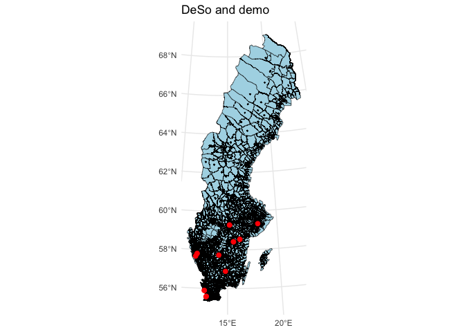<!-- -->

``` r
demo_neighbourhoods<-st_intersects(demo_transformed, deso)
demo_neighbourhoods.df<-as.data.frame(demo_neighbourhoods)

demo_neighbourhoods.df <- demo_neighbourhoods.df %>%
  rename(row.id.demo = row.id,
         row.id = col.id)

deso$row.id<-as.numeric(row.names(deso))
deso<-left_join(deso, demo_neighbourhoods.df, by="row.id")

deso <- deso %>%
  mutate(is.in.demo=case_when(row.id.demo>0  ~ 1,
                              is.na(row.id.demo) ~ NA))
```

Generate a database with neighborhood statistics and create shares for
variables. Add neighborhood area and population density.

``` r
database <- empl %>%
  left_join(edu)  %>%
  left_join(age)  %>%
  left_join(background)  %>%
  left_join(family)  %>%
  left_join(housing)  %>%
  left_join(income)  %>%
  left_join(status)  %>%
  left_join(estates)
```

    ## Joining with `by = join_by(deso)`
    ## Joining with `by = join_by(deso)`
    ## Joining with `by = join_by(deso)`
    ## Joining with `by = join_by(deso)`
    ## Joining with `by = join_by(deso)`
    ## Joining with `by = join_by(deso)`
    ## Joining with `by = join_by(deso)`
    ## Joining with `by = join_by(deso)`

``` r
database <- database %>% mutate_at(names(database)[-1], as.numeric) 

database <- database  %>%
  mutate(utanför_arbetskraften_p=utanför_rbetskraften/totalt_empl) %>%
  mutate(arbetslösan_p=arbetslösa/totalt_empl) %>%
  mutate(förgymnasial_p=(förgymnasial)/(förgymnasial+gymnasial+eftergymnasial_kort+eftergymnasial_lång+saknas_edu)) %>%
  mutate(eftergymnasial_p=(eftergymnasial_kort+eftergymnasial_lång)/(förgymnasial+gymnasial+eftergymnasial_kort+eftergymnasial_lång+saknas_edu)) %>%
  mutate(youth_p=(g4+g5)/totalt_age) %>%
  mutate(utländsk_p=utländsk/totalt_background) %>%
  mutate(ensam_med_barn_p=e_b/(s_b+s_ub+e_b+e_ut+o)) %>%
  mutate(hyresrätt_p=hyresrätt/(hyresrätt+bostadsrätt+äganderätt+saknas_housing)) %>%
  mutate(låg_p=låg/100) %>%
  mutate(flerbostadshus_p=flerbostadshus/totalt_estates)

pop <- read_excel("deso_data/000005FC_20240806-102837.xlsx",
                  skip=2)[,c(-1)]
```

    ## New names:
    ## • `` -> `...1`
    ## • `` -> `...2`

``` r
pop <- pop %>% 
  rename_with(~c("deso", "total"))

deso <- deso %>% 
  left_join(pop)
```

    ## Joining with `by = join_by(deso)`

``` r
deso$area <- st_area(deso)
deso$area<-as.numeric(deso$area)
deso$pop_dens= deso$total/(deso$area*0.000001)
```

To control for base level of crime add data on burglary provided by
Manne and combine with database with neighborhood statistics

``` r
crime<-read.csv("crime_data/burglary subset for juta.csv")

table(crime$Brottskod.klartext)
```

    ## 
    ##                                                      Inbrotsstöld i fritidshus 
    ##                                                                          16663 
    ##                                              Inbrottsstöld, försök, i lägenhet 
    ##                                                                           8103 
    ##                                          Inbrottsstöld, försök, i villa/radhus 
    ##                                                                           8254 
    ##                                          Inbrottsstöld, fullbordat, i lägenhet 
    ##                                                                          19181 
    ##                                      Inbrottsstöld, fullbordat, i villa/radhus 
    ##                                                                          25285 
    ##        Stöld av skjutvapen, ammunition och sprängämne, i bostad, ej fritidshus 
    ##                                                                            312 
    ##                   Stöld av skjutvapen, ammunition och sprängämne, i fritidshus 
    ##                                                                             63 
    ##                                         Stöld genom inbrott från källare, vind 
    ##                                                                          96329 
    ## Stöld, utan inbrott, från bostad, ej fritidshus, ej hos äldre/funktionsnedsatt 
    ##                                                                          31774 
    ##    Stöld, utan inbrott, från bostad, ej fritidshus, hos äldre/funktionsnedsatt 
    ##                                                                          24118

``` r
crime_sum <- crime %>%
  filter(substr(Brottsdatum, 1, 4)=="2020") %>%
  rename("deso" = "DeSO.område") %>%
  group_by(deso) %>%
  summarise(Freq.crime = sum(as.numeric(Antal)))

crime_sum2 <- pop %>% 
  left_join(crime_sum) %>% 
  mutate(Freq.crime = replace_na(Freq.crime, 0)) %>% 
  mutate(Rate.crime = Freq.crime/total*1000)
```

    ## Joining with `by = join_by(deso)`

``` r
deso <- deso %>% 
  left_join(crime_sum2)
```

    ## Joining with `by = join_by(deso, total)`

``` r
#join and replace NAs with 0s
database <- database %>%
  left_join(deso) %>%
    mutate(
    is.in = replace_na(is.in, 0),
    is.in.demo = replace_na(is.in.demo, 0)
  )
```

    ## Joining with `by = join_by(deso)`

#### Add segregation

Following Malmberg et al we add isolation index for foreign-born at
kommun level calculated over deso.

``` r
database <- database %>%
  mutate(komm = substr(deso, 1, 4))

#isolation index for foreign born at kommun level over deso
database <- database %>%
  mutate(komm = substr(deso, 1, 4)) %>%
  dplyr::select(komm, deso,  svensk, utländsk) %>%
  pivot_longer(cols = c("svensk", "utländsk"),
               names_to = "group",
               values_to = "number") %>%
  group_by(komm) %>%
  group_split() %>% set_names(unique(database$komm)) %>%
  lapply(., isolation, group="group", unit="deso", weight="number") %>%
  as.data.frame() %>%
  slice(2) %>%
  dplyr::select(ends_with("isolation")) %>%
  pivot_longer(cols = ends_with("isolation"),
               names_to = "name",
               values_to = "isolation_utl") %>%
    mutate(komm = substr(name, 2, 5)) %>% dplyr::select(-name) %>%
  right_join(database)
```

    ## Joining with `by = join_by(komm)`

#### Police relations

Police perceptions where low values are high trust in police and high
values are low trust in police. Note that we can also include measures
based on disparities between all and immigrant perceptions, ie. if on
average perceptions of the police are fine but among immigrants they are
bad that could be a sign of discrimination.

We also create 2 variables where one is a measure of discrimination
based on differences in perception of the police by immigrants and
general population and the other is distortion, based on the absolute
value of discrimination variable.

``` r
load("kommun_data/full_data.RData")
load("kommun_data/immigrants_data.RData")

names(som_select)
```

    ##  [1] "kommun"                    "year"                     
    ##  [3] "trust_police_average"      "concern_org_crime_average"
    ##  [5] "total_complaints"          "total_investigations"     
    ##  [7] "population_total"          "education_average"        
    ##  [9] "income_average"            "Ort"                      
    ## [11] "complaints_rates"          "investigations_rates"

``` r
names(som_select_immigrants)
```

    ##  [1] "kommun"                          "year"                           
    ##  [3] "trust_police_immbackground"      "concern_org_crime_immbackground"
    ##  [5] "total_complaints"                "total_investigations"           
    ##  [7] "population_total"                "education_average"              
    ##  [9] "income_average"                  "Ort"                            
    ## [11] "complaints_rates"                "investigations_rates"

``` r
som_select <- som_select %>%
  right_join(som_select_immigrants[c("kommun", "year" , "Ort", "trust_police_immbackground", "concern_org_crime_immbackground")])
```

    ## Joining with `by = join_by(kommun, year, Ort)`

``` r
som_select %>%
  group_by(year) %>%
  summarise(mean_trust_police_immbackground = mean(trust_police_immbackground, na.rm = TRUE), 
            mean_trust_police_average = mean(trust_police_average, na.rm = TRUE)) %>%
  ggplot(aes(x = year)) +
  geom_line(aes(y = mean_trust_police_immbackground, color = "Immigrant Background", group="Immigrant Background")) +
  geom_line(aes(y = mean_trust_police_average, color = "Average", group="Average")) +
  labs(title = "Mean Trust in Police Over Years",
       x = "Year",
       y = "Mean Trust",
       color = "Legend") +
  theme_bw()
```

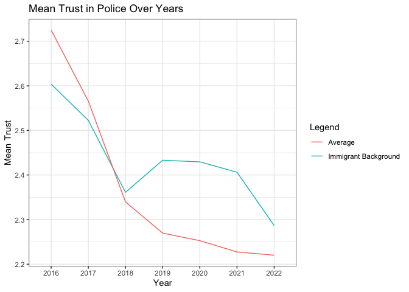<!-- -->

``` r
cor(som_select[c("trust_police_average", "trust_police_immbackground", "concern_org_crime_average", "total_complaints", "total_investigations")], use="pairwise.complete.obs") %>%
  corrplot(., method = 'number') 
```

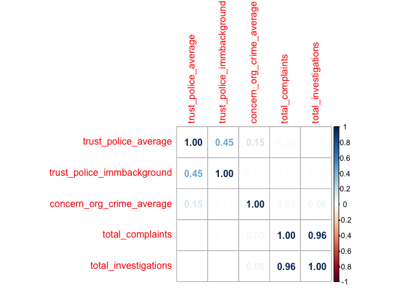<!-- -->

``` r
ggplot(som_select[som_select$year==2021,], aes(x = trust_police_average)) + geom_histogram() + 
  geom_vline(aes(xintercept = mean(trust_police_average, na.rm = TRUE)), 
             color = "red", size = 1, linetype = "dashed") +
  theme_bw()
```

    ## Warning: Using `size` aesthetic for lines was deprecated in ggplot2 3.4.0.
    ## ℹ Please use `linewidth` instead.
    ## This warning is displayed once every 8 hours.
    ## Call `lifecycle::last_lifecycle_warnings()` to see where this warning was
    ## generated.

    ## `stat_bin()` using `bins = 30`. Pick better value with `binwidth`.

<!-- -->

``` r
ggplot(som_select[som_select$year==2021,], aes(x = trust_police_immbackground)) + geom_histogram() +
   geom_vline(aes(xintercept = mean(trust_police_average, na.rm = TRUE)), 
             color = "red", size = 1, linetype = "dashed") + theme_bw()
```

    ## `stat_bin()` using `bins = 30`. Pick better value with `binwidth`.

    ## Warning: Removed 86 rows containing non-finite outside the scale range
    ## (`stat_bin()`).

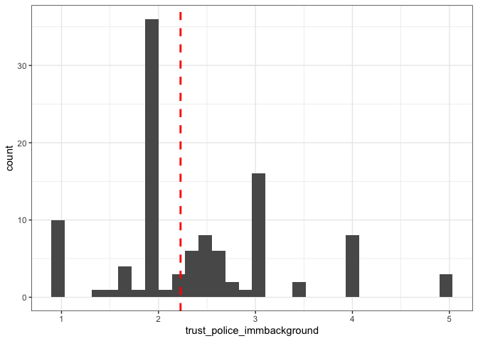<!-- -->

``` r
som_select[som_select$year==2021,] %>%
  drop_na(trust_police_immbackground) %>%
  drop_na(trust_police_average) %>% ggplot(aes(x = trust_police_immbackground, y = trust_police_average)) + 
  geom_point(alpha=0.2)  + theme_bw()  +
  geom_abline(slope = 1, intercept = 0, color = "red", linetype = "dashed") + geom_rug()
```

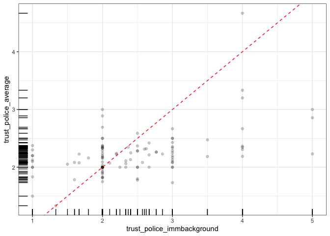<!-- -->

``` r
database$komm_n<-as.numeric(database$komm)

#note that a combination of year and kommun gives some duplicated values
which(duplicated(som_select[c("kommun", "year")]))
```

    ## [1]   28  501  637  839 1096 1299

``` r
som_select.sel<-som_select %>%
  dplyr::select(kommun, year, trust_police_average, trust_police_immbackground) %>% filter(year==2021) %>%  distinct()

database <- database %>%
  left_join(som_select.sel, by=c("komm_n"="kommun"))

#discrimination and distortion
database$discrim=database$trust_police_average-database$trust_police_immbackground
database$distort=abs(database$trust_police_average-database$trust_police_immbackground)
```

#### Dependent variable

Create dependent variable which is the sum of riot-related crimes for
modelling and examine the data. For dependent variable the median is 0
and mean is 0.3997, there are a couple of neighborhoods which pull the
distribution to the right. The variation is 12.41247, suggesting
overdispersion. The Q1 consists of neighborhoods with 0 events which
means that we need to consider whether hurdle or zero-inflated models
would be a better choice.

The distribution shows that most of neighborhoods have 0 events and a
few have a relatively high number of cases. Should we worry about the
outliers?

``` r
database <- database  %>%
  mutate(dv=Freq_sabotage+Freq_vald+Freq_upplop)

summary(database$dv)
```

    ##     Min.  1st Qu.   Median     Mean  3rd Qu.     Max. 
    ##   0.0000   0.0000   0.0000   0.4197   0.0000 200.0000

``` r
var(database$dv)
```

    ## [1] 13.23078

``` r
database %>%
  dplyr::select(deso, kommunnamn, lannamn, dv) %>%
  arrange(desc(dv)) %>% 
  slice_head(n = 30)
```

    ## # A tibble: 30 × 4
    ##    deso      kommunnamn lannamn         dv
    ##    <chr>     <chr>      <chr>        <int>
    ##  1 1880C1220 Örebro     Örebro         200
    ##  2 0580C1670 Linköping  Östergötland   131
    ##  3 0581C1030 Norrköping Östergötland    53
    ##  4 0581C1030 Norrköping Östergötland    53
    ##  5 0180C4040 Stockholm  Stockholm       44
    ##  6 0184C1310 Solna      Stockholm       43
    ##  7 0180C5340 Stockholm  Stockholm       37
    ##  8 1282C1170 Landskrona Skåne           37
    ##  9 1282C1170 Landskrona Skåne           37
    ## 10 1880C1190 Örebro     Örebro          33
    ## # ℹ 20 more rows

``` r
ggplot(database) + 
  geom_density(mapping=aes(dv), fill="steelblue", alpha=0.7) +
  labs(x="Events") +
  theme_bw()
```

<!-- --> \### Correlations Let’s
have a look at correlations between the dependent variable and potential
independent variables. The highest correlations are for the share
foreign-born and unemployment in the neighbourhood and being on a list
of utsatta områden (is.in) and both share foreign-born and unemployment.
Also for kommun level segregation (isolation_utl), high correlation with
share of foreign-born, population density and utsatta områden.

``` r
corr_mat = cor(database[c("dv", "arbetslösan_p", "utländsk_p", "youth_p", "pop_dens", "Rate.crime", "is.in", "is.in.demo", "isolation_utl", "trust_police_average")], use="pairwise.complete.obs")
corrplot(corr_mat, method = 'number', number.cex = 0.5) 
```

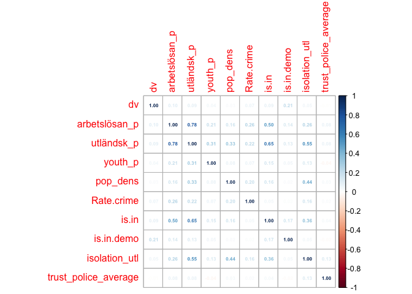<!-- -->

``` r
summary(model.prm0<-glm(dv ~ arbetslösan_p + utländsk_p + offset(log(totalt_age)), family="poisson", data = database))
```

    ## 
    ## Call:
    ## glm(formula = dv ~ arbetslösan_p + utländsk_p + offset(log(totalt_age)), 
    ##     family = "poisson", data = database)
    ## 
    ## Coefficients:
    ##               Estimate Std. Error  z value Pr(>|z|)    
    ## (Intercept)   -9.17472    0.03605 -254.511  < 2e-16 ***
    ## arbetslösan_p 10.24105    0.63642   16.092  < 2e-16 ***
    ## utländsk_p     0.97896    0.12590    7.776  7.5e-15 ***
    ## ---
    ## Signif. codes:  0 '***' 0.001 '**' 0.01 '*' 0.05 '.' 0.1 ' ' 1
    ## 
    ## (Dispersion parameter for poisson family taken to be 1)
    ## 
    ##     Null deviance: 13724  on 6011  degrees of freedom
    ## Residual deviance: 12524  on 6009  degrees of freedom
    ## AIC: 14868
    ## 
    ## Number of Fisher Scoring iterations: 7

### Poisson

Start with a simple Poisson model which takes into account only share
unemployed and share with foreign background in the neighborhood and an
offset for the total number of people in the neighborhood. Both
independent variables are statistically significant with a positive
coefficient, suggesting that neighborhood with higher unemployment and
higher share of residents with foreign background have also more riot
events.

``` r
summary(model.prm0<-glm(dv ~ arbetslösan_p + utländsk_p + offset(log(totalt_age)), family="poisson", data = database))
```

    ## 
    ## Call:
    ## glm(formula = dv ~ arbetslösan_p + utländsk_p + offset(log(totalt_age)), 
    ##     family = "poisson", data = database)
    ## 
    ## Coefficients:
    ##               Estimate Std. Error  z value Pr(>|z|)    
    ## (Intercept)   -9.17472    0.03605 -254.511  < 2e-16 ***
    ## arbetslösan_p 10.24105    0.63642   16.092  < 2e-16 ***
    ## utländsk_p     0.97896    0.12590    7.776  7.5e-15 ***
    ## ---
    ## Signif. codes:  0 '***' 0.001 '**' 0.01 '*' 0.05 '.' 0.1 ' ' 1
    ## 
    ## (Dispersion parameter for poisson family taken to be 1)
    ## 
    ##     Null deviance: 13724  on 6011  degrees of freedom
    ## Residual deviance: 12524  on 6009  degrees of freedom
    ## AIC: 14868
    ## 
    ## Number of Fisher Scoring iterations: 7

The next question is about overdispersion, is there enough of it to
cause a problem? Seems not to be a major issue since the p-value is
actually larger than 0.05 but we test what happens if we use negative
binomial regression instead.

``` r
dispersiontest(model.prm0)
```

    ## 
    ##  Overdispersion test
    ## 
    ## data:  model.prm0
    ## z = 1.4612, p-value = 0.07198
    ## alternative hypothesis: true dispersion is greater than 1
    ## sample estimates:
    ## dispersion 
    ##   22.02936

### Negative Binomial

Now run negative binomial model and compare goodness of fit between
Poisson and negative binomial regression models. Negative binomial has a
larger log-likelihood and that negative binomial works better.

``` r
summary(model.nbrm0<-glm.nb(dv ~ arbetslösan_p + utländsk_p + offset(log(totalt_age)), data = database))
```

    ## 
    ## Call:
    ## glm.nb(formula = dv ~ arbetslösan_p + utländsk_p + offset(log(totalt_age)), 
    ##     data = database, init.theta = 0.1437343117, link = log)
    ## 
    ## Coefficients:
    ##               Estimate Std. Error  z value Pr(>|z|)    
    ## (Intercept)   -9.38161    0.07062 -132.840  < 2e-16 ***
    ## arbetslösan_p  8.54094    1.90983    4.472 7.75e-06 ***
    ## utländsk_p     1.88676    0.31403    6.008 1.88e-09 ***
    ## ---
    ## Signif. codes:  0 '***' 0.001 '**' 0.01 '*' 0.05 '.' 0.1 ' ' 1
    ## 
    ## (Dispersion parameter for Negative Binomial(0.1437) family taken to be 1)
    ## 
    ##     Null deviance: 2799.5  on 6011  degrees of freedom
    ## Residual deviance: 2521.1  on 6009  degrees of freedom
    ## AIC: 7969.5
    ## 
    ## Number of Fisher Scoring iterations: 1
    ## 
    ## 
    ##               Theta:  0.14373 
    ##           Std. Err.:  0.00709 
    ## 
    ##  2 x log-likelihood:  -7961.50500

``` r
logLik(model.prm0)
```

    ## 'log Lik.' -7430.869 (df=3)

``` r
logLik(model.nbrm0)
```

    ## 'log Lik.' -3980.753 (df=4)

``` r
c(model.prm0$aic, model.nbrm0$aic)
```

    ## [1] 14867.739  7969.505

### Testing for excess zero problem

The number of observed zeros is 5034, predicted zeros are 5060 and the
ratio is close to 1.

``` r
check_zeroinflation(model.nbrm0)
```

    ## # Check for zero-inflation
    ## 
    ##    Observed zeros: 5035
    ##   Predicted zeros: 5064
    ##             Ratio: 1.01

    ## Model seems ok, ratio of observed and predicted zeros is within the
    ##   tolerance range (p = 0.320).

``` r
summary(model.nbrm0)
```

    ## 
    ## Call:
    ## glm.nb(formula = dv ~ arbetslösan_p + utländsk_p + offset(log(totalt_age)), 
    ##     data = database, init.theta = 0.1437343117, link = log)
    ## 
    ## Coefficients:
    ##               Estimate Std. Error  z value Pr(>|z|)    
    ## (Intercept)   -9.38161    0.07062 -132.840  < 2e-16 ***
    ## arbetslösan_p  8.54094    1.90983    4.472 7.75e-06 ***
    ## utländsk_p     1.88676    0.31403    6.008 1.88e-09 ***
    ## ---
    ## Signif. codes:  0 '***' 0.001 '**' 0.01 '*' 0.05 '.' 0.1 ' ' 1
    ## 
    ## (Dispersion parameter for Negative Binomial(0.1437) family taken to be 1)
    ## 
    ##     Null deviance: 2799.5  on 6011  degrees of freedom
    ## Residual deviance: 2521.1  on 6009  degrees of freedom
    ## AIC: 7969.5
    ## 
    ## Number of Fisher Scoring iterations: 1
    ## 
    ## 
    ##               Theta:  0.14373 
    ##           Std. Err.:  0.00709 
    ## 
    ##  2 x log-likelihood:  -7961.50500

### Adding variables to negative binomial model

In `model.nbrm1` we add share of youth and and population density. In
`model.nbr1a` we further add a dummy variable for neighborhoods where
Quran burning demos took place or were planned, base crime rates in 2020
and whether the neighborhood overlapped with areas on vulnerable areas
list. Model `model.nbrm1b` adds predictors at kommun level: segregation
and average trust in police. Model `model.nbrm1c` replaces average trust
in police with trust among immigrants and model `model.nbrm1d` adds
discrimination variable, based on differences in trust in police between
population and immigrants. In Model `model.nbrm1e` we see that the
interaction of share foreign-born and kommun segregation is significant,
see the plot below for different levels of segregation (measured by
isolation index of foreign-born). Segregation seems to make a difference
up till up to about 0.4 foreign-born with neighborhoods that are located
in more segregated municipalities experiencing more rioting.

Some observations:

- Trust in police is not significant
- Trust in police for immigrants is, same for discrimination
- There is evidence of interaction between share of foreign-born and
  segregation

``` r
summary(model.nbrm1<-glm.nb(dv ~ arbetslösan_p + utländsk_p + youth_p + pop_dens + offset(log(totalt_age)), data = database))
```

    ## 
    ## Call:
    ## glm.nb(formula = dv ~ arbetslösan_p + utländsk_p + youth_p + 
    ##     pop_dens + offset(log(totalt_age)), data = database, init.theta = 0.1466723658, 
    ##     link = log)
    ## 
    ## Coefficients:
    ##                 Estimate Std. Error z value Pr(>|z|)    
    ## (Intercept)   -9.744e+00  1.233e-01 -79.014  < 2e-16 ***
    ## arbetslösan_p  1.002e+01  1.924e+00   5.209 1.90e-07 ***
    ## utländsk_p     1.384e+00  3.393e-01   4.078 4.54e-05 ***
    ## youth_p        2.503e+00  1.022e+00   2.450   0.0143 *  
    ## pop_dens       3.801e-05  6.602e-06   5.757 8.54e-09 ***
    ## ---
    ## Signif. codes:  0 '***' 0.001 '**' 0.01 '*' 0.05 '.' 0.1 ' ' 1
    ## 
    ## (Dispersion parameter for Negative Binomial(0.1467) family taken to be 1)
    ## 
    ##     Null deviance: 2832.1  on 6011  degrees of freedom
    ## Residual deviance: 2517.3  on 6007  degrees of freedom
    ## AIC: 7941.4
    ## 
    ## Number of Fisher Scoring iterations: 1
    ## 
    ## 
    ##               Theta:  0.14667 
    ##           Std. Err.:  0.00722 
    ## 
    ##  2 x log-likelihood:  -7929.36300

``` r
summary(model.nbrm1a<-glm.nb(dv ~ arbetslösan_p + utländsk_p + youth_p + pop_dens + Rate.crime + is.in.demo + is.in + offset(log(totalt_age)), data = database))
```

    ## 
    ## Call:
    ## glm.nb(formula = dv ~ arbetslösan_p + utländsk_p + youth_p + 
    ##     pop_dens + Rate.crime + is.in.demo + is.in + offset(log(totalt_age)), 
    ##     data = database, init.theta = 0.1661238587, link = log)
    ## 
    ## Coefficients:
    ##                 Estimate Std. Error z value Pr(>|z|)    
    ## (Intercept)   -9.945e+00  1.274e-01 -78.058  < 2e-16 ***
    ## arbetslösan_p  3.844e+00  1.895e+00   2.029 0.042478 *  
    ## utländsk_p     1.454e+00  3.808e-01   3.820 0.000134 ***
    ## youth_p        1.339e+00  9.998e-01   1.340 0.180383    
    ## pop_dens       2.177e-05  6.539e-06   3.330 0.000869 ***
    ## Rate.crime     1.057e-01  9.335e-03  11.318  < 2e-16 ***
    ## is.in.demo     2.235e+00  6.139e-01   3.640 0.000273 ***
    ## is.in          1.377e-01  1.778e-01   0.775 0.438635    
    ## ---
    ## Signif. codes:  0 '***' 0.001 '**' 0.01 '*' 0.05 '.' 0.1 ' ' 1
    ## 
    ## (Dispersion parameter for Negative Binomial(0.1661) family taken to be 1)
    ## 
    ##     Null deviance: 3038.0  on 6011  degrees of freedom
    ## Residual deviance: 2557.8  on 6004  degrees of freedom
    ## AIC: 7816.2
    ## 
    ## Number of Fisher Scoring iterations: 1
    ## 
    ## 
    ##               Theta:  0.16612 
    ##           Std. Err.:  0.00846 
    ## 
    ##  2 x log-likelihood:  -7798.23500

``` r
summary(model.nbrm1b<-glm.nb(dv ~ arbetslösan_p + utländsk_p + youth_p + pop_dens + Rate.crime + is.in.demo + is.in + isolation_utl + trust_police_average + offset(log(totalt_age)), data = database))
```

    ## 
    ## Call:
    ## glm.nb(formula = dv ~ arbetslösan_p + utländsk_p + youth_p + 
    ##     pop_dens + Rate.crime + is.in.demo + is.in + isolation_utl + 
    ##     trust_police_average + offset(log(totalt_age)), data = database, 
    ##     init.theta = 0.1575209613, link = log)
    ## 
    ## Coefficients:
    ##                        Estimate Std. Error z value Pr(>|z|)    
    ## (Intercept)          -1.032e+01  4.061e-01 -25.407  < 2e-16 ***
    ## arbetslösan_p         6.930e+00  2.220e+00   3.122  0.00180 ** 
    ## utländsk_p            3.966e-01  4.666e-01   0.850  0.39535    
    ## youth_p               7.120e-01  1.089e+00   0.654  0.51329    
    ## pop_dens              9.932e-06  7.136e-06   1.392  0.16397    
    ## Rate.crime            1.095e-01  1.026e-02  10.678  < 2e-16 ***
    ## is.in.demo            2.206e+00  6.317e-01   3.492  0.00048 ***
    ## is.in                 2.009e-01  1.900e-01   1.057  0.29039    
    ## isolation_utl         1.677e+00  4.171e-01   4.020 5.83e-05 ***
    ## trust_police_average  7.097e-03  1.686e-01   0.042  0.96642    
    ## ---
    ## Signif. codes:  0 '***' 0.001 '**' 0.01 '*' 0.05 '.' 0.1 ' ' 1
    ## 
    ## (Dispersion parameter for Negative Binomial(0.1575) family taken to be 1)
    ## 
    ##     Null deviance: 2506.9  on 4864  degrees of freedom
    ## Residual deviance: 2088.2  on 4855  degrees of freedom
    ##   (1147 observations deleted due to missingness)
    ## AIC: 6564.2
    ## 
    ## Number of Fisher Scoring iterations: 1
    ## 
    ## 
    ##               Theta:  0.15752 
    ##           Std. Err.:  0.00860 
    ## 
    ##  2 x log-likelihood:  -6542.17800

``` r
summary(model.nbrm1c<-glm.nb(dv ~ arbetslösan_p + utländsk_p + youth_p + Rate.crime + pop_dens + is.in + is.in.demo + isolation_utl + trust_police_immbackground + offset(log(totalt_age)), data = database))
```

    ## 
    ## Call:
    ## glm.nb(formula = dv ~ arbetslösan_p + utländsk_p + youth_p + 
    ##     Rate.crime + pop_dens + is.in + is.in.demo + isolation_utl + 
    ##     trust_police_immbackground + offset(log(totalt_age)), data = database, 
    ##     init.theta = 0.1559406975, link = log)
    ## 
    ## Coefficients:
    ##                              Estimate Std. Error z value Pr(>|z|)    
    ## (Intercept)                -1.093e+01  2.919e-01 -37.444  < 2e-16 ***
    ## arbetslösan_p               3.507e+00  2.417e+00   1.451   0.1468    
    ## utländsk_p                  1.012e+00  4.997e-01   2.026   0.0428 *  
    ## youth_p                    -3.551e-01  1.169e+00  -0.304   0.7613    
    ## Rate.crime                  1.093e-01  1.142e-02   9.568  < 2e-16 ***
    ## pop_dens                    3.578e-06  7.410e-06   0.483   0.6292    
    ## is.in                       9.517e-02  2.005e-01   0.475   0.6351    
    ## is.in.demo                  2.118e+00  6.750e-01   3.137   0.0017 ** 
    ## isolation_utl               1.116e+00  4.783e-01   2.333   0.0197 *  
    ## trust_police_immbackground  4.093e-01  7.652e-02   5.349 8.83e-08 ***
    ## ---
    ## Signif. codes:  0 '***' 0.001 '**' 0.01 '*' 0.05 '.' 0.1 ' ' 1
    ## 
    ## (Dispersion parameter for Negative Binomial(0.1559) family taken to be 1)
    ## 
    ##     Null deviance: 2008.8  on 3806  degrees of freedom
    ## Residual deviance: 1706.6  on 3797  degrees of freedom
    ##   (2205 observations deleted due to missingness)
    ## AIC: 5487.4
    ## 
    ## Number of Fisher Scoring iterations: 1
    ## 
    ## 
    ##               Theta:  0.15594 
    ##           Std. Err.:  0.00917 
    ## 
    ##  2 x log-likelihood:  -5465.41100

``` r
summary(model.nbrm1d<-glm.nb(dv ~ arbetslösan_p + utländsk_p + youth_p + Rate.crime + pop_dens + is.in + is.in.demo + isolation_utl + trust_police_average + discrim + offset(log(totalt_age)), data = database))
```

    ## 
    ## Call:
    ## glm.nb(formula = dv ~ arbetslösan_p + utländsk_p + youth_p + 
    ##     Rate.crime + pop_dens + is.in + is.in.demo + isolation_utl + 
    ##     trust_police_average + discrim + offset(log(totalt_age)), 
    ##     data = database, init.theta = 0.1564272754, link = log)
    ## 
    ## Coefficients:
    ##                        Estimate Std. Error z value Pr(>|z|)    
    ## (Intercept)          -1.012e+01  5.802e-01 -17.436  < 2e-16 ***
    ## arbetslösan_p         3.400e+00  2.424e+00   1.403  0.16068    
    ## utländsk_p            1.055e+00  4.996e-01   2.112  0.03472 *  
    ## youth_p              -6.311e-01  1.179e+00  -0.535  0.59238    
    ## Rate.crime            1.078e-01  1.141e-02   9.442  < 2e-16 ***
    ## pop_dens              3.224e-06  7.412e-06   0.435  0.66363    
    ## is.in                 9.676e-02  2.005e-01   0.483  0.62942    
    ## is.in.demo            2.108e+00  6.742e-01   3.127  0.00177 ** 
    ## isolation_utl         1.213e+00  4.851e-01   2.501  0.01238 *  
    ## trust_police_average  3.265e-02  2.563e-01   0.127  0.89862    
    ## discrim              -4.432e-01  8.360e-02  -5.301 1.15e-07 ***
    ## ---
    ## Signif. codes:  0 '***' 0.001 '**' 0.01 '*' 0.05 '.' 0.1 ' ' 1
    ## 
    ## (Dispersion parameter for Negative Binomial(0.1564) family taken to be 1)
    ## 
    ##     Null deviance: 2012.5  on 3806  degrees of freedom
    ## Residual deviance: 1707.7  on 3796  degrees of freedom
    ##   (2205 observations deleted due to missingness)
    ## AIC: 5487.5
    ## 
    ## Number of Fisher Scoring iterations: 1
    ## 
    ## 
    ##               Theta:  0.15643 
    ##           Std. Err.:  0.00921 
    ## 
    ##  2 x log-likelihood:  -5463.54500

``` r
summary(model.nbrm1e<-glm.nb(dv ~ arbetslösan_p + youth_p + Rate.crime + pop_dens + is.in + is.in.demo + utländsk_p*isolation_utl + offset(log(totalt_age)), data = database))
```

    ## 
    ## Call:
    ## glm.nb(formula = dv ~ arbetslösan_p + youth_p + Rate.crime + 
    ##     pop_dens + is.in + is.in.demo + utländsk_p * isolation_utl + 
    ##     offset(log(totalt_age)), data = database, init.theta = 0.1726527343, 
    ##     link = log)
    ## 
    ## Coefficients:
    ##                            Estimate Std. Error z value Pr(>|z|)    
    ## (Intercept)              -1.090e+01  2.162e-01 -50.440  < 2e-16 ***
    ## arbetslösan_p             5.953e+00  1.979e+00   3.008 0.002628 ** 
    ## youth_p                   1.117e+00  1.010e+00   1.106 0.268617    
    ## Rate.crime                9.430e-02  9.309e-03  10.130  < 2e-16 ***
    ## pop_dens                  1.206e-05  6.741e-06   1.788 0.073728 .  
    ## is.in                     3.148e-01  1.853e-01   1.699 0.089372 .  
    ## is.in.demo                2.107e+00  6.034e-01   3.491 0.000481 ***
    ## utländsk_p                3.597e+00  8.801e-01   4.087 4.37e-05 ***
    ## isolation_utl             3.132e+00  5.301e-01   5.908 3.47e-09 ***
    ## utländsk_p:isolation_utl -6.722e+00  1.658e+00  -4.054 5.02e-05 ***
    ## ---
    ## Signif. codes:  0 '***' 0.001 '**' 0.01 '*' 0.05 '.' 0.1 ' ' 1
    ## 
    ## (Dispersion parameter for Negative Binomial(0.1727) family taken to be 1)
    ## 
    ##     Null deviance: 3103.6  on 6011  degrees of freedom
    ## Residual deviance: 2576.2  on 6002  degrees of freedom
    ## AIC: 7786.4
    ## 
    ## Number of Fisher Scoring iterations: 1
    ## 
    ## 
    ##               Theta:  0.17265 
    ##           Std. Err.:  0.00892 
    ## 
    ##  2 x log-likelihood:  -7764.42600

``` r
#Compare the coefficients from the two models
tab_model(model.nbrm1, model.nbrm1a, model.nbrm1b, model.nbrm1c, model.nbrm1d, model.nbrm1e, dv.labels=c("model.nbrm1", "model.nbrm1a", "model.nbrm1b", "model.nbrm1c", "model.nbrm1d", "model.nbrm1e"))
```

<table style="border-collapse:collapse; border:none;">
<tr>
<th style="border-top: double; text-align:center; font-style:normal; font-weight:bold; padding:0.2cm;  text-align:left; ">
 
</th>
<th colspan="3" style="border-top: double; text-align:center; font-style:normal; font-weight:bold; padding:0.2cm; ">
model.nbrm1
</th>
<th colspan="3" style="border-top: double; text-align:center; font-style:normal; font-weight:bold; padding:0.2cm; ">
model.nbrm1a
</th>
<th colspan="3" style="border-top: double; text-align:center; font-style:normal; font-weight:bold; padding:0.2cm; ">
model.nbrm1b
</th>
<th colspan="3" style="border-top: double; text-align:center; font-style:normal; font-weight:bold; padding:0.2cm; ">
model.nbrm1c
</th>
<th colspan="3" style="border-top: double; text-align:center; font-style:normal; font-weight:bold; padding:0.2cm; ">
model.nbrm1d
</th>
<th colspan="3" style="border-top: double; text-align:center; font-style:normal; font-weight:bold; padding:0.2cm; ">
model.nbrm1e
</th>
</tr>
<tr>
<td style=" text-align:center; border-bottom:1px solid; font-style:italic; font-weight:normal;  text-align:left; ">
Predictors
</td>
<td style=" text-align:center; border-bottom:1px solid; font-style:italic; font-weight:normal;  ">
Incidence Rate Ratios
</td>
<td style=" text-align:center; border-bottom:1px solid; font-style:italic; font-weight:normal;  ">
CI
</td>
<td style=" text-align:center; border-bottom:1px solid; font-style:italic; font-weight:normal;  ">
p
</td>
<td style=" text-align:center; border-bottom:1px solid; font-style:italic; font-weight:normal;  ">
Incidence Rate Ratios
</td>
<td style=" text-align:center; border-bottom:1px solid; font-style:italic; font-weight:normal;  ">
CI
</td>
<td style=" text-align:center; border-bottom:1px solid; font-style:italic; font-weight:normal;  col7">
p
</td>
<td style=" text-align:center; border-bottom:1px solid; font-style:italic; font-weight:normal;  col8">
Incidence Rate Ratios
</td>
<td style=" text-align:center; border-bottom:1px solid; font-style:italic; font-weight:normal;  col9">
CI
</td>
<td style=" text-align:center; border-bottom:1px solid; font-style:italic; font-weight:normal;  0">
p
</td>
<td style=" text-align:center; border-bottom:1px solid; font-style:italic; font-weight:normal;  1">
Incidence Rate Ratios
</td>
<td style=" text-align:center; border-bottom:1px solid; font-style:italic; font-weight:normal;  2">
CI
</td>
<td style=" text-align:center; border-bottom:1px solid; font-style:italic; font-weight:normal;  3">
p
</td>
<td style=" text-align:center; border-bottom:1px solid; font-style:italic; font-weight:normal;  4">
Incidence Rate Ratios
</td>
<td style=" text-align:center; border-bottom:1px solid; font-style:italic; font-weight:normal;  5">
CI
</td>
<td style=" text-align:center; border-bottom:1px solid; font-style:italic; font-weight:normal;  6">
p
</td>
<td style=" text-align:center; border-bottom:1px solid; font-style:italic; font-weight:normal;  7">
Incidence Rate Ratios
</td>
<td style=" text-align:center; border-bottom:1px solid; font-style:italic; font-weight:normal;  8">
CI
</td>
<td style=" text-align:center; border-bottom:1px solid; font-style:italic; font-weight:normal;  9">
p
</td>
</tr>
<tr>
<td style=" padding:0.2cm; text-align:left; vertical-align:top; text-align:left; ">
(Intercept)
</td>
<td style=" padding:0.2cm; text-align:left; vertical-align:top; text-align:center;  ">
0.00
</td>
<td style=" padding:0.2cm; text-align:left; vertical-align:top; text-align:center;  ">
0.00 – 0.00
</td>
<td style=" padding:0.2cm; text-align:left; vertical-align:top; text-align:center;  ">
<strong>\<0.001</strong>
</td>
<td style=" padding:0.2cm; text-align:left; vertical-align:top; text-align:center;  ">
0.00
</td>
<td style=" padding:0.2cm; text-align:left; vertical-align:top; text-align:center;  ">
0.00 – 0.00
</td>
<td style=" padding:0.2cm; text-align:left; vertical-align:top; text-align:center;  col7">
<strong>\<0.001</strong>
</td>
<td style=" padding:0.2cm; text-align:left; vertical-align:top; text-align:center;  col8">
0.00
</td>
<td style=" padding:0.2cm; text-align:left; vertical-align:top; text-align:center;  col9">
0.00 – 0.00
</td>
<td style=" padding:0.2cm; text-align:left; vertical-align:top; text-align:center;  0">
<strong>\<0.001</strong>
</td>
<td style=" padding:0.2cm; text-align:left; vertical-align:top; text-align:center;  1">
0.00
</td>
<td style=" padding:0.2cm; text-align:left; vertical-align:top; text-align:center;  2">
0.00 – 0.00
</td>
<td style=" padding:0.2cm; text-align:left; vertical-align:top; text-align:center;  3">
<strong>\<0.001</strong>
</td>
<td style=" padding:0.2cm; text-align:left; vertical-align:top; text-align:center;  4">
0.00
</td>
<td style=" padding:0.2cm; text-align:left; vertical-align:top; text-align:center;  5">
0.00 – 0.00
</td>
<td style=" padding:0.2cm; text-align:left; vertical-align:top; text-align:center;  6">
<strong>\<0.001</strong>
</td>
<td style=" padding:0.2cm; text-align:left; vertical-align:top; text-align:center;  7">
0.00
</td>
<td style=" padding:0.2cm; text-align:left; vertical-align:top; text-align:center;  8">
0.00 – 0.00
</td>
<td style=" padding:0.2cm; text-align:left; vertical-align:top; text-align:center;  9">
<strong>\<0.001</strong>
</td>
</tr>
<tr>
<td style=" padding:0.2cm; text-align:left; vertical-align:top; text-align:left; ">
arbetslösan p
</td>
<td style=" padding:0.2cm; text-align:left; vertical-align:top; text-align:center;  ">
22518.67
</td>
<td style=" padding:0.2cm; text-align:left; vertical-align:top; text-align:center;  ">
442.63 – 1188620.98
</td>
<td style=" padding:0.2cm; text-align:left; vertical-align:top; text-align:center;  ">
<strong>\<0.001</strong>
</td>
<td style=" padding:0.2cm; text-align:left; vertical-align:top; text-align:center;  ">
46.71
</td>
<td style=" padding:0.2cm; text-align:left; vertical-align:top; text-align:center;  ">
1.09 – 2101.12
</td>
<td style=" padding:0.2cm; text-align:left; vertical-align:top; text-align:center;  col7">
<strong>0.042</strong>
</td>
<td style=" padding:0.2cm; text-align:left; vertical-align:top; text-align:center;  col8">
1022.42
</td>
<td style=" padding:0.2cm; text-align:left; vertical-align:top; text-align:center;  col9">
11.43 – 96514.45
</td>
<td style=" padding:0.2cm; text-align:left; vertical-align:top; text-align:center;  0">
<strong>0.002</strong>
</td>
<td style=" padding:0.2cm; text-align:left; vertical-align:top; text-align:center;  1">
33.34
</td>
<td style=" padding:0.2cm; text-align:left; vertical-align:top; text-align:center;  2">
0.24 – 4874.71
</td>
<td style=" padding:0.2cm; text-align:left; vertical-align:top; text-align:center;  3">
0.147
</td>
<td style=" padding:0.2cm; text-align:left; vertical-align:top; text-align:center;  4">
29.98
</td>
<td style=" padding:0.2cm; text-align:left; vertical-align:top; text-align:center;  5">
0.22 – 4291.50
</td>
<td style=" padding:0.2cm; text-align:left; vertical-align:top; text-align:center;  6">
0.161
</td>
<td style=" padding:0.2cm; text-align:left; vertical-align:top; text-align:center;  7">
384.98
</td>
<td style=" padding:0.2cm; text-align:left; vertical-align:top; text-align:center;  8">
6.54 – 23710.79
</td>
<td style=" padding:0.2cm; text-align:left; vertical-align:top; text-align:center;  9">
<strong>0.003</strong>
</td>
</tr>
<tr>
<td style=" padding:0.2cm; text-align:left; vertical-align:top; text-align:left; ">
utländsk p
</td>
<td style=" padding:0.2cm; text-align:left; vertical-align:top; text-align:center;  ">
3.99
</td>
<td style=" padding:0.2cm; text-align:left; vertical-align:top; text-align:center;  ">
1.95 – 8.28
</td>
<td style=" padding:0.2cm; text-align:left; vertical-align:top; text-align:center;  ">
<strong>\<0.001</strong>
</td>
<td style=" padding:0.2cm; text-align:left; vertical-align:top; text-align:center;  ">
4.28
</td>
<td style=" padding:0.2cm; text-align:left; vertical-align:top; text-align:center;  ">
1.97 – 9.46
</td>
<td style=" padding:0.2cm; text-align:left; vertical-align:top; text-align:center;  col7">
<strong>\<0.001</strong>
</td>
<td style=" padding:0.2cm; text-align:left; vertical-align:top; text-align:center;  col8">
1.49
</td>
<td style=" padding:0.2cm; text-align:left; vertical-align:top; text-align:center;  col9">
0.55 – 4.06
</td>
<td style=" padding:0.2cm; text-align:left; vertical-align:top; text-align:center;  0">
0.395
</td>
<td style=" padding:0.2cm; text-align:left; vertical-align:top; text-align:center;  1">
2.75
</td>
<td style=" padding:0.2cm; text-align:left; vertical-align:top; text-align:center;  2">
0.95 – 8.16
</td>
<td style=" padding:0.2cm; text-align:left; vertical-align:top; text-align:center;  3">
<strong>0.043</strong>
</td>
<td style=" padding:0.2cm; text-align:left; vertical-align:top; text-align:center;  4">
2.87
</td>
<td style=" padding:0.2cm; text-align:left; vertical-align:top; text-align:center;  5">
0.99 – 8.50
</td>
<td style=" padding:0.2cm; text-align:left; vertical-align:top; text-align:center;  6">
<strong>0.035</strong>
</td>
<td style=" padding:0.2cm; text-align:left; vertical-align:top; text-align:center;  7">
36.49
</td>
<td style=" padding:0.2cm; text-align:left; vertical-align:top; text-align:center;  8">
6.25 – 211.71
</td>
<td style=" padding:0.2cm; text-align:left; vertical-align:top; text-align:center;  9">
<strong>\<0.001</strong>
</td>
</tr>
<tr>
<td style=" padding:0.2cm; text-align:left; vertical-align:top; text-align:left; ">
youth p
</td>
<td style=" padding:0.2cm; text-align:left; vertical-align:top; text-align:center;  ">
12.22
</td>
<td style=" padding:0.2cm; text-align:left; vertical-align:top; text-align:center;  ">
1.22 – 136.51
</td>
<td style=" padding:0.2cm; text-align:left; vertical-align:top; text-align:center;  ">
<strong>0.014</strong>
</td>
<td style=" padding:0.2cm; text-align:left; vertical-align:top; text-align:center;  ">
3.82
</td>
<td style=" padding:0.2cm; text-align:left; vertical-align:top; text-align:center;  ">
0.42 – 38.31
</td>
<td style=" padding:0.2cm; text-align:left; vertical-align:top; text-align:center;  col7">
0.180
</td>
<td style=" padding:0.2cm; text-align:left; vertical-align:top; text-align:center;  col8">
2.04
</td>
<td style=" padding:0.2cm; text-align:left; vertical-align:top; text-align:center;  col9">
0.20 – 22.59
</td>
<td style=" padding:0.2cm; text-align:left; vertical-align:top; text-align:center;  0">
0.513
</td>
<td style=" padding:0.2cm; text-align:left; vertical-align:top; text-align:center;  1">
0.70
</td>
<td style=" padding:0.2cm; text-align:left; vertical-align:top; text-align:center;  2">
0.06 – 8.66
</td>
<td style=" padding:0.2cm; text-align:left; vertical-align:top; text-align:center;  3">
0.761
</td>
<td style=" padding:0.2cm; text-align:left; vertical-align:top; text-align:center;  4">
0.53
</td>
<td style=" padding:0.2cm; text-align:left; vertical-align:top; text-align:center;  5">
0.04 – 6.70
</td>
<td style=" padding:0.2cm; text-align:left; vertical-align:top; text-align:center;  6">
0.592
</td>
<td style=" padding:0.2cm; text-align:left; vertical-align:top; text-align:center;  7">
3.06
</td>
<td style=" padding:0.2cm; text-align:left; vertical-align:top; text-align:center;  8">
0.34 – 29.87
</td>
<td style=" padding:0.2cm; text-align:left; vertical-align:top; text-align:center;  9">
0.269
</td>
</tr>
<tr>
<td style=" padding:0.2cm; text-align:left; vertical-align:top; text-align:left; ">
pop dens
</td>
<td style=" padding:0.2cm; text-align:left; vertical-align:top; text-align:center;  ">
1.00
</td>
<td style=" padding:0.2cm; text-align:left; vertical-align:top; text-align:center;  ">
1.00 – 1.00
</td>
<td style=" padding:0.2cm; text-align:left; vertical-align:top; text-align:center;  ">
<strong>\<0.001</strong>
</td>
<td style=" padding:0.2cm; text-align:left; vertical-align:top; text-align:center;  ">
1.00
</td>
<td style=" padding:0.2cm; text-align:left; vertical-align:top; text-align:center;  ">
1.00 – 1.00
</td>
<td style=" padding:0.2cm; text-align:left; vertical-align:top; text-align:center;  col7">
<strong>0.001</strong>
</td>
<td style=" padding:0.2cm; text-align:left; vertical-align:top; text-align:center;  col8">
1.00
</td>
<td style=" padding:0.2cm; text-align:left; vertical-align:top; text-align:center;  col9">
1.00 – 1.00
</td>
<td style=" padding:0.2cm; text-align:left; vertical-align:top; text-align:center;  0">
0.164
</td>
<td style=" padding:0.2cm; text-align:left; vertical-align:top; text-align:center;  1">
1.00
</td>
<td style=" padding:0.2cm; text-align:left; vertical-align:top; text-align:center;  2">
1.00 – 1.00
</td>
<td style=" padding:0.2cm; text-align:left; vertical-align:top; text-align:center;  3">
0.629
</td>
<td style=" padding:0.2cm; text-align:left; vertical-align:top; text-align:center;  4">
1.00
</td>
<td style=" padding:0.2cm; text-align:left; vertical-align:top; text-align:center;  5">
1.00 – 1.00
</td>
<td style=" padding:0.2cm; text-align:left; vertical-align:top; text-align:center;  6">
0.664
</td>
<td style=" padding:0.2cm; text-align:left; vertical-align:top; text-align:center;  7">
1.00
</td>
<td style=" padding:0.2cm; text-align:left; vertical-align:top; text-align:center;  8">
1.00 – 1.00
</td>
<td style=" padding:0.2cm; text-align:left; vertical-align:top; text-align:center;  9">
0.074
</td>
</tr>
<tr>
<td style=" padding:0.2cm; text-align:left; vertical-align:top; text-align:left; ">
Rate crime
</td>
<td style=" padding:0.2cm; text-align:left; vertical-align:top; text-align:center;  ">
</td>
<td style=" padding:0.2cm; text-align:left; vertical-align:top; text-align:center;  ">
</td>
<td style=" padding:0.2cm; text-align:left; vertical-align:top; text-align:center;  ">
</td>
<td style=" padding:0.2cm; text-align:left; vertical-align:top; text-align:center;  ">
1.11
</td>
<td style=" padding:0.2cm; text-align:left; vertical-align:top; text-align:center;  ">
1.09 – 1.14
</td>
<td style=" padding:0.2cm; text-align:left; vertical-align:top; text-align:center;  col7">
<strong>\<0.001</strong>
</td>
<td style=" padding:0.2cm; text-align:left; vertical-align:top; text-align:center;  col8">
1.12
</td>
<td style=" padding:0.2cm; text-align:left; vertical-align:top; text-align:center;  col9">
1.09 – 1.14
</td>
<td style=" padding:0.2cm; text-align:left; vertical-align:top; text-align:center;  0">
<strong>\<0.001</strong>
</td>
<td style=" padding:0.2cm; text-align:left; vertical-align:top; text-align:center;  1">
1.12
</td>
<td style=" padding:0.2cm; text-align:left; vertical-align:top; text-align:center;  2">
1.09 – 1.15
</td>
<td style=" padding:0.2cm; text-align:left; vertical-align:top; text-align:center;  3">
<strong>\<0.001</strong>
</td>
<td style=" padding:0.2cm; text-align:left; vertical-align:top; text-align:center;  4">
1.11
</td>
<td style=" padding:0.2cm; text-align:left; vertical-align:top; text-align:center;  5">
1.08 – 1.15
</td>
<td style=" padding:0.2cm; text-align:left; vertical-align:top; text-align:center;  6">
<strong>\<0.001</strong>
</td>
<td style=" padding:0.2cm; text-align:left; vertical-align:top; text-align:center;  7">
1.10
</td>
<td style=" padding:0.2cm; text-align:left; vertical-align:top; text-align:center;  8">
1.08 – 1.12
</td>
<td style=" padding:0.2cm; text-align:left; vertical-align:top; text-align:center;  9">
<strong>\<0.001</strong>
</td>
</tr>
<tr>
<td style=" padding:0.2cm; text-align:left; vertical-align:top; text-align:left; ">
is in demo
</td>
<td style=" padding:0.2cm; text-align:left; vertical-align:top; text-align:center;  ">
</td>
<td style=" padding:0.2cm; text-align:left; vertical-align:top; text-align:center;  ">
</td>
<td style=" padding:0.2cm; text-align:left; vertical-align:top; text-align:center;  ">
</td>
<td style=" padding:0.2cm; text-align:left; vertical-align:top; text-align:center;  ">
9.34
</td>
<td style=" padding:0.2cm; text-align:left; vertical-align:top; text-align:center;  ">
3.31 – 40.75
</td>
<td style=" padding:0.2cm; text-align:left; vertical-align:top; text-align:center;  col7">
<strong>\<0.001</strong>
</td>
<td style=" padding:0.2cm; text-align:left; vertical-align:top; text-align:center;  col8">
9.08
</td>
<td style=" padding:0.2cm; text-align:left; vertical-align:top; text-align:center;  col9">
3.12 – 41.67
</td>
<td style=" padding:0.2cm; text-align:left; vertical-align:top; text-align:center;  0">
<strong>\<0.001</strong>
</td>
<td style=" padding:0.2cm; text-align:left; vertical-align:top; text-align:center;  1">
8.31
</td>
<td style=" padding:0.2cm; text-align:left; vertical-align:top; text-align:center;  2">
2.69 – 43.52
</td>
<td style=" padding:0.2cm; text-align:left; vertical-align:top; text-align:center;  3">
<strong>0.002</strong>
</td>
<td style=" padding:0.2cm; text-align:left; vertical-align:top; text-align:center;  4">
8.23
</td>
<td style=" padding:0.2cm; text-align:left; vertical-align:top; text-align:center;  5">
2.67 – 42.98
</td>
<td style=" padding:0.2cm; text-align:left; vertical-align:top; text-align:center;  6">
<strong>0.002</strong>
</td>
<td style=" padding:0.2cm; text-align:left; vertical-align:top; text-align:center;  7">
8.22
</td>
<td style=" padding:0.2cm; text-align:left; vertical-align:top; text-align:center;  8">
2.95 – 34.72
</td>
<td style=" padding:0.2cm; text-align:left; vertical-align:top; text-align:center;  9">
<strong>\<0.001</strong>
</td>
</tr>
<tr>
<td style=" padding:0.2cm; text-align:left; vertical-align:top; text-align:left; ">
is in
</td>
<td style=" padding:0.2cm; text-align:left; vertical-align:top; text-align:center;  ">
</td>
<td style=" padding:0.2cm; text-align:left; vertical-align:top; text-align:center;  ">
</td>
<td style=" padding:0.2cm; text-align:left; vertical-align:top; text-align:center;  ">
</td>
<td style=" padding:0.2cm; text-align:left; vertical-align:top; text-align:center;  ">
1.15
</td>
<td style=" padding:0.2cm; text-align:left; vertical-align:top; text-align:center;  ">
0.80 – 1.65
</td>
<td style=" padding:0.2cm; text-align:left; vertical-align:top; text-align:center;  col7">
0.439
</td>
<td style=" padding:0.2cm; text-align:left; vertical-align:top; text-align:center;  col8">
1.22
</td>
<td style=" padding:0.2cm; text-align:left; vertical-align:top; text-align:center;  col9">
0.83 – 1.81
</td>
<td style=" padding:0.2cm; text-align:left; vertical-align:top; text-align:center;  0">
0.290
</td>
<td style=" padding:0.2cm; text-align:left; vertical-align:top; text-align:center;  1">
1.10
</td>
<td style=" padding:0.2cm; text-align:left; vertical-align:top; text-align:center;  2">
0.73 – 1.67
</td>
<td style=" padding:0.2cm; text-align:left; vertical-align:top; text-align:center;  3">
0.635
</td>
<td style=" padding:0.2cm; text-align:left; vertical-align:top; text-align:center;  4">
1.10
</td>
<td style=" padding:0.2cm; text-align:left; vertical-align:top; text-align:center;  5">
0.73 – 1.67
</td>
<td style=" padding:0.2cm; text-align:left; vertical-align:top; text-align:center;  6">
0.629
</td>
<td style=" padding:0.2cm; text-align:left; vertical-align:top; text-align:center;  7">
1.37
</td>
<td style=" padding:0.2cm; text-align:left; vertical-align:top; text-align:center;  8">
0.95 – 1.99
</td>
<td style=" padding:0.2cm; text-align:left; vertical-align:top; text-align:center;  9">
0.089
</td>
</tr>
<tr>
<td style=" padding:0.2cm; text-align:left; vertical-align:top; text-align:left; ">
isolation utl
</td>
<td style=" padding:0.2cm; text-align:left; vertical-align:top; text-align:center;  ">
</td>
<td style=" padding:0.2cm; text-align:left; vertical-align:top; text-align:center;  ">
</td>
<td style=" padding:0.2cm; text-align:left; vertical-align:top; text-align:center;  ">
</td>
<td style=" padding:0.2cm; text-align:left; vertical-align:top; text-align:center;  ">
</td>
<td style=" padding:0.2cm; text-align:left; vertical-align:top; text-align:center;  ">
</td>
<td style=" padding:0.2cm; text-align:left; vertical-align:top; text-align:center;  col7">
</td>
<td style=" padding:0.2cm; text-align:left; vertical-align:top; text-align:center;  col8">
5.35
</td>
<td style=" padding:0.2cm; text-align:left; vertical-align:top; text-align:center;  col9">
2.24 – 12.80
</td>
<td style=" padding:0.2cm; text-align:left; vertical-align:top; text-align:center;  0">
<strong>\<0.001</strong>
</td>
<td style=" padding:0.2cm; text-align:left; vertical-align:top; text-align:center;  1">
3.05
</td>
<td style=" padding:0.2cm; text-align:left; vertical-align:top; text-align:center;  2">
1.12 – 8.30
</td>
<td style=" padding:0.2cm; text-align:left; vertical-align:top; text-align:center;  3">
<strong>0.020</strong>
</td>
<td style=" padding:0.2cm; text-align:left; vertical-align:top; text-align:center;  4">
3.36
</td>
<td style=" padding:0.2cm; text-align:left; vertical-align:top; text-align:center;  5">
1.23 – 9.21
</td>
<td style=" padding:0.2cm; text-align:left; vertical-align:top; text-align:center;  6">
<strong>0.012</strong>
</td>
<td style=" padding:0.2cm; text-align:left; vertical-align:top; text-align:center;  7">
22.92
</td>
<td style=" padding:0.2cm; text-align:left; vertical-align:top; text-align:center;  8">
8.07 – 65.11
</td>
<td style=" padding:0.2cm; text-align:left; vertical-align:top; text-align:center;  9">
<strong>\<0.001</strong>
</td>
</tr>
<tr>
<td style=" padding:0.2cm; text-align:left; vertical-align:top; text-align:left; ">
trust police average
</td>
<td style=" padding:0.2cm; text-align:left; vertical-align:top; text-align:center;  ">
</td>
<td style=" padding:0.2cm; text-align:left; vertical-align:top; text-align:center;  ">
</td>
<td style=" padding:0.2cm; text-align:left; vertical-align:top; text-align:center;  ">
</td>
<td style=" padding:0.2cm; text-align:left; vertical-align:top; text-align:center;  ">
</td>
<td style=" padding:0.2cm; text-align:left; vertical-align:top; text-align:center;  ">
</td>
<td style=" padding:0.2cm; text-align:left; vertical-align:top; text-align:center;  col7">
</td>
<td style=" padding:0.2cm; text-align:left; vertical-align:top; text-align:center;  col8">
1.01
</td>
<td style=" padding:0.2cm; text-align:left; vertical-align:top; text-align:center;  col9">
0.70 – 1.46
</td>
<td style=" padding:0.2cm; text-align:left; vertical-align:top; text-align:center;  0">
0.966
</td>
<td style=" padding:0.2cm; text-align:left; vertical-align:top; text-align:center;  1">
</td>
<td style=" padding:0.2cm; text-align:left; vertical-align:top; text-align:center;  2">
</td>
<td style=" padding:0.2cm; text-align:left; vertical-align:top; text-align:center;  3">
</td>
<td style=" padding:0.2cm; text-align:left; vertical-align:top; text-align:center;  4">
1.03
</td>
<td style=" padding:0.2cm; text-align:left; vertical-align:top; text-align:center;  5">
0.59 – 1.81
</td>
<td style=" padding:0.2cm; text-align:left; vertical-align:top; text-align:center;  6">
0.899
</td>
<td style=" padding:0.2cm; text-align:left; vertical-align:top; text-align:center;  7">
</td>
<td style=" padding:0.2cm; text-align:left; vertical-align:top; text-align:center;  8">
</td>
<td style=" padding:0.2cm; text-align:left; vertical-align:top; text-align:center;  9">
</td>
</tr>
<tr>
<td style=" padding:0.2cm; text-align:left; vertical-align:top; text-align:left; ">
trust police<br>immbackground
</td>
<td style=" padding:0.2cm; text-align:left; vertical-align:top; text-align:center;  ">
</td>
<td style=" padding:0.2cm; text-align:left; vertical-align:top; text-align:center;  ">
</td>
<td style=" padding:0.2cm; text-align:left; vertical-align:top; text-align:center;  ">
</td>
<td style=" padding:0.2cm; text-align:left; vertical-align:top; text-align:center;  ">
</td>
<td style=" padding:0.2cm; text-align:left; vertical-align:top; text-align:center;  ">
</td>
<td style=" padding:0.2cm; text-align:left; vertical-align:top; text-align:center;  col7">
</td>
<td style=" padding:0.2cm; text-align:left; vertical-align:top; text-align:center;  col8">
</td>
<td style=" padding:0.2cm; text-align:left; vertical-align:top; text-align:center;  col9">
</td>
<td style=" padding:0.2cm; text-align:left; vertical-align:top; text-align:center;  0">
</td>
<td style=" padding:0.2cm; text-align:left; vertical-align:top; text-align:center;  1">
1.51
</td>
<td style=" padding:0.2cm; text-align:left; vertical-align:top; text-align:center;  2">
1.29 – 1.76
</td>
<td style=" padding:0.2cm; text-align:left; vertical-align:top; text-align:center;  3">
<strong>\<0.001</strong>
</td>
<td style=" padding:0.2cm; text-align:left; vertical-align:top; text-align:center;  4">
</td>
<td style=" padding:0.2cm; text-align:left; vertical-align:top; text-align:center;  5">
</td>
<td style=" padding:0.2cm; text-align:left; vertical-align:top; text-align:center;  6">
</td>
<td style=" padding:0.2cm; text-align:left; vertical-align:top; text-align:center;  7">
</td>
<td style=" padding:0.2cm; text-align:left; vertical-align:top; text-align:center;  8">
</td>
<td style=" padding:0.2cm; text-align:left; vertical-align:top; text-align:center;  9">
</td>
</tr>
<tr>
<td style=" padding:0.2cm; text-align:left; vertical-align:top; text-align:left; ">
discrim
</td>
<td style=" padding:0.2cm; text-align:left; vertical-align:top; text-align:center;  ">
</td>
<td style=" padding:0.2cm; text-align:left; vertical-align:top; text-align:center;  ">
</td>
<td style=" padding:0.2cm; text-align:left; vertical-align:top; text-align:center;  ">
</td>
<td style=" padding:0.2cm; text-align:left; vertical-align:top; text-align:center;  ">
</td>
<td style=" padding:0.2cm; text-align:left; vertical-align:top; text-align:center;  ">
</td>
<td style=" padding:0.2cm; text-align:left; vertical-align:top; text-align:center;  col7">
</td>
<td style=" padding:0.2cm; text-align:left; vertical-align:top; text-align:center;  col8">
</td>
<td style=" padding:0.2cm; text-align:left; vertical-align:top; text-align:center;  col9">
</td>
<td style=" padding:0.2cm; text-align:left; vertical-align:top; text-align:center;  0">
</td>
<td style=" padding:0.2cm; text-align:left; vertical-align:top; text-align:center;  1">
</td>
<td style=" padding:0.2cm; text-align:left; vertical-align:top; text-align:center;  2">
</td>
<td style=" padding:0.2cm; text-align:left; vertical-align:top; text-align:center;  3">
</td>
<td style=" padding:0.2cm; text-align:left; vertical-align:top; text-align:center;  4">
0.64
</td>
<td style=" padding:0.2cm; text-align:left; vertical-align:top; text-align:center;  5">
0.55 – 0.75
</td>
<td style=" padding:0.2cm; text-align:left; vertical-align:top; text-align:center;  6">
<strong>\<0.001</strong>
</td>
<td style=" padding:0.2cm; text-align:left; vertical-align:top; text-align:center;  7">
</td>
<td style=" padding:0.2cm; text-align:left; vertical-align:top; text-align:center;  8">
</td>
<td style=" padding:0.2cm; text-align:left; vertical-align:top; text-align:center;  9">
</td>
</tr>
<tr>
<td style=" padding:0.2cm; text-align:left; vertical-align:top; text-align:left; ">
utländsk p × isolation<br>utl
</td>
<td style=" padding:0.2cm; text-align:left; vertical-align:top; text-align:center;  ">
</td>
<td style=" padding:0.2cm; text-align:left; vertical-align:top; text-align:center;  ">
</td>
<td style=" padding:0.2cm; text-align:left; vertical-align:top; text-align:center;  ">
</td>
<td style=" padding:0.2cm; text-align:left; vertical-align:top; text-align:center;  ">
</td>
<td style=" padding:0.2cm; text-align:left; vertical-align:top; text-align:center;  ">
</td>
<td style=" padding:0.2cm; text-align:left; vertical-align:top; text-align:center;  col7">
</td>
<td style=" padding:0.2cm; text-align:left; vertical-align:top; text-align:center;  col8">
</td>
<td style=" padding:0.2cm; text-align:left; vertical-align:top; text-align:center;  col9">
</td>
<td style=" padding:0.2cm; text-align:left; vertical-align:top; text-align:center;  0">
</td>
<td style=" padding:0.2cm; text-align:left; vertical-align:top; text-align:center;  1">
</td>
<td style=" padding:0.2cm; text-align:left; vertical-align:top; text-align:center;  2">
</td>
<td style=" padding:0.2cm; text-align:left; vertical-align:top; text-align:center;  3">
</td>
<td style=" padding:0.2cm; text-align:left; vertical-align:top; text-align:center;  4">
</td>
<td style=" padding:0.2cm; text-align:left; vertical-align:top; text-align:center;  5">
</td>
<td style=" padding:0.2cm; text-align:left; vertical-align:top; text-align:center;  6">
</td>
<td style=" padding:0.2cm; text-align:left; vertical-align:top; text-align:center;  7">
0.00
</td>
<td style=" padding:0.2cm; text-align:left; vertical-align:top; text-align:center;  8">
0.00 – 0.03
</td>
<td style=" padding:0.2cm; text-align:left; vertical-align:top; text-align:center;  9">
<strong>\<0.001</strong>
</td>
</tr>
<tr>
<td style=" padding:0.2cm; text-align:left; vertical-align:top; text-align:left; padding-top:0.1cm; padding-bottom:0.1cm; border-top:1px solid;">
Observations
</td>
<td style=" padding:0.2cm; text-align:left; vertical-align:top; padding-top:0.1cm; padding-bottom:0.1cm; text-align:left; border-top:1px solid;" colspan="3">
6012
</td>
<td style=" padding:0.2cm; text-align:left; vertical-align:top; padding-top:0.1cm; padding-bottom:0.1cm; text-align:left; border-top:1px solid;" colspan="3">
6012
</td>
<td style=" padding:0.2cm; text-align:left; vertical-align:top; padding-top:0.1cm; padding-bottom:0.1cm; text-align:left; border-top:1px solid;" colspan="3">
4865
</td>
<td style=" padding:0.2cm; text-align:left; vertical-align:top; padding-top:0.1cm; padding-bottom:0.1cm; text-align:left; border-top:1px solid;" colspan="3">
3807
</td>
<td style=" padding:0.2cm; text-align:left; vertical-align:top; padding-top:0.1cm; padding-bottom:0.1cm; text-align:left; border-top:1px solid;" colspan="3">
3807
</td>
<td style=" padding:0.2cm; text-align:left; vertical-align:top; padding-top:0.1cm; padding-bottom:0.1cm; text-align:left; border-top:1px solid;" colspan="3">
6012
</td>
</tr>
<tr>
<td style=" padding:0.2cm; text-align:left; vertical-align:top; text-align:left; padding-top:0.1cm; padding-bottom:0.1cm;">
R<sup>2</sup> Nagelkerke
</td>
<td style=" padding:0.2cm; text-align:left; vertical-align:top; padding-top:0.1cm; padding-bottom:0.1cm; text-align:left;" colspan="3">
0.136
</td>
<td style=" padding:0.2cm; text-align:left; vertical-align:top; padding-top:0.1cm; padding-bottom:0.1cm; text-align:left;" colspan="3">
0.194
</td>
<td style=" padding:0.2cm; text-align:left; vertical-align:top; padding-top:0.1cm; padding-bottom:0.1cm; text-align:left;" colspan="3">
0.205
</td>
<td style=" padding:0.2cm; text-align:left; vertical-align:top; padding-top:0.1cm; padding-bottom:0.1cm; text-align:left;" colspan="3">
0.186
</td>
<td style=" padding:0.2cm; text-align:left; vertical-align:top; padding-top:0.1cm; padding-bottom:0.1cm; text-align:left;" colspan="3">
0.187
</td>
<td style=" padding:0.2cm; text-align:left; vertical-align:top; padding-top:0.1cm; padding-bottom:0.1cm; text-align:left;" colspan="3">
0.208
</td>
</tr>
</table>

``` r
#Let's visualise the interaction effects between share of foreign born and segregation

eff <- effect("utländsk_p:isolation_utl", model.nbrm1e) 

# Plot the effect
plot(eff, 
     main = "Interaction share foreign-born and segregation",
     xlab = "Share foreign born",
     ylab = "Predicted events",
     multiline = TRUE,  
     ci.style = "bands") 
```

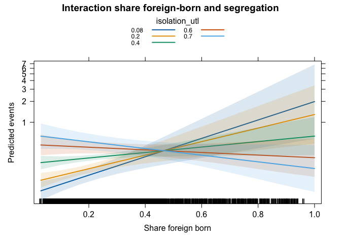<!-- -->

``` r
#adjust standard errors for clustering

summary(model.nbrm1d)
```

    ## 
    ## Call:
    ## glm.nb(formula = dv ~ arbetslösan_p + utländsk_p + youth_p + 
    ##     Rate.crime + pop_dens + is.in + is.in.demo + isolation_utl + 
    ##     trust_police_average + discrim + offset(log(totalt_age)), 
    ##     data = database, init.theta = 0.1564272754, link = log)
    ## 
    ## Coefficients:
    ##                        Estimate Std. Error z value Pr(>|z|)    
    ## (Intercept)          -1.012e+01  5.802e-01 -17.436  < 2e-16 ***
    ## arbetslösan_p         3.400e+00  2.424e+00   1.403  0.16068    
    ## utländsk_p            1.055e+00  4.996e-01   2.112  0.03472 *  
    ## youth_p              -6.311e-01  1.179e+00  -0.535  0.59238    
    ## Rate.crime            1.078e-01  1.141e-02   9.442  < 2e-16 ***
    ## pop_dens              3.224e-06  7.412e-06   0.435  0.66363    
    ## is.in                 9.676e-02  2.005e-01   0.483  0.62942    
    ## is.in.demo            2.108e+00  6.742e-01   3.127  0.00177 ** 
    ## isolation_utl         1.213e+00  4.851e-01   2.501  0.01238 *  
    ## trust_police_average  3.265e-02  2.563e-01   0.127  0.89862    
    ## discrim              -4.432e-01  8.360e-02  -5.301 1.15e-07 ***
    ## ---
    ## Signif. codes:  0 '***' 0.001 '**' 0.01 '*' 0.05 '.' 0.1 ' ' 1
    ## 
    ## (Dispersion parameter for Negative Binomial(0.1564) family taken to be 1)
    ## 
    ##     Null deviance: 2012.5  on 3806  degrees of freedom
    ## Residual deviance: 1707.7  on 3796  degrees of freedom
    ##   (2205 observations deleted due to missingness)
    ## AIC: 5487.5
    ## 
    ## Number of Fisher Scoring iterations: 1
    ## 
    ## 
    ##               Theta:  0.15643 
    ##           Std. Err.:  0.00921 
    ## 
    ##  2 x log-likelihood:  -5463.54500

``` r
coeftest(model.nbrm1d, vcov = vcovCL, cluster = ~kommun)
```

    ## 
    ## z test of coefficients:
    ## 
    ##                         Estimate  Std. Error  z value  Pr(>|z|)    
    ## (Intercept)          -1.0117e+01  6.5286e-01 -15.4962 < 2.2e-16 ***
    ## arbetslösan_p         3.4004e+00  5.0167e+00   0.6778 0.4978949    
    ## utländsk_p            1.0549e+00  7.1659e-01   1.4721 0.1409959    
    ## youth_p              -6.3111e-01  2.2118e+00  -0.2853 0.7753805    
    ## Rate.crime            1.0776e-01  1.6455e-02   6.5488 5.799e-11 ***
    ## pop_dens              3.2236e-06  1.2328e-05   0.2615 0.7937149    
    ## is.in                 9.6757e-02  4.3558e-01   0.2221 0.8242121    
    ## is.in.demo            2.1080e+00  6.2565e-01   3.3693 0.0007536 ***
    ## isolation_utl         1.2132e+00  8.6682e-01   1.3996 0.1616389    
    ## trust_police_average  3.2653e-02  3.2631e-01   0.1001 0.9202901    
    ## discrim              -4.4317e-01  1.7461e-01  -2.5381 0.0111465 *  
    ## ---
    ## Signif. codes:  0 '***' 0.001 '**' 0.01 '*' 0.05 '.' 0.1 ' ' 1

In `model.nbrm2` we introduce fixed effects at the municipal level. Note
that `model.nbrm2` to achieve convergence we needed to scale the
predictors, to compare the coefficients we run re-scaled model based on
previous models (without municipal level variables because these do not
allow for them) and call it `model.nbrm1_scaled`. There are not big
differences in these model specifications.

``` r
database <- database %>%
  mutate(kommun = str_sub(deso, 1, 4))

scaled_database<-database %>%
   mutate_at(c('arbetslösan_p', 'utländsk_p', 'youth_p', 'Rate.crime'), funs(c(scale(.))))
```

    ## Warning: `funs()` was deprecated in dplyr 0.8.0.
    ## ℹ Please use a list of either functions or lambdas:
    ## 
    ## # Simple named list: list(mean = mean, median = median)
    ## 
    ## # Auto named with `tibble::lst()`: tibble::lst(mean, median)
    ## 
    ## # Using lambdas list(~ mean(., trim = .2), ~ median(., na.rm = TRUE))
    ## Call `lifecycle::last_lifecycle_warnings()` to see where this warning was
    ## generated.

``` r
model.nbrm1_unscaled<-glm.nb(dv ~ arbetslösan_p + utländsk_p + Rate.crime + is.in + is.in.demo + offset(log(totalt_age)), data = database)

model.nbrm1_scaled<-glm.nb(dv ~ arbetslösan_p + utländsk_p + Rate.crime + is.in + is.in.demo + offset(log(totalt_age)), data = scaled_database)

model.nbrm2<-glmer.nb(dv ~ arbetslösan_p + utländsk_p + Rate.crime + is.in + is.in.demo + offset(log(totalt_age)) + (1|kommun), control=glmerControl(optimizer="bobyqa", optCtrl=list(maxfun=2e5)), data = scaled_database)

library(sjPlot)
#Compare the coefficients from the two models
tab_model(model.nbrm2, model.nbrm1_scaled, model.nbrm1_unscaled, dv.labels=c("Fixed-effects", "Scaled", "Unscaled"))
```

<table style="border-collapse:collapse; border:none;">
<tr>
<th style="border-top: double; text-align:center; font-style:normal; font-weight:bold; padding:0.2cm;  text-align:left; ">
 
</th>
<th colspan="3" style="border-top: double; text-align:center; font-style:normal; font-weight:bold; padding:0.2cm; ">
Fixed-effects
</th>
<th colspan="3" style="border-top: double; text-align:center; font-style:normal; font-weight:bold; padding:0.2cm; ">
Scaled
</th>
<th colspan="3" style="border-top: double; text-align:center; font-style:normal; font-weight:bold; padding:0.2cm; ">
Unscaled
</th>
</tr>
<tr>
<td style=" text-align:center; border-bottom:1px solid; font-style:italic; font-weight:normal;  text-align:left; ">
Predictors
</td>
<td style=" text-align:center; border-bottom:1px solid; font-style:italic; font-weight:normal;  ">
Incidence Rate Ratios
</td>
<td style=" text-align:center; border-bottom:1px solid; font-style:italic; font-weight:normal;  ">
CI
</td>
<td style=" text-align:center; border-bottom:1px solid; font-style:italic; font-weight:normal;  ">
p
</td>
<td style=" text-align:center; border-bottom:1px solid; font-style:italic; font-weight:normal;  ">
Incidence Rate Ratios
</td>
<td style=" text-align:center; border-bottom:1px solid; font-style:italic; font-weight:normal;  ">
CI
</td>
<td style=" text-align:center; border-bottom:1px solid; font-style:italic; font-weight:normal;  col7">
p
</td>
<td style=" text-align:center; border-bottom:1px solid; font-style:italic; font-weight:normal;  col8">
Incidence Rate Ratios
</td>
<td style=" text-align:center; border-bottom:1px solid; font-style:italic; font-weight:normal;  col9">
CI
</td>
<td style=" text-align:center; border-bottom:1px solid; font-style:italic; font-weight:normal;  0">
p
</td>
</tr>
<tr>
<td style=" padding:0.2cm; text-align:left; vertical-align:top; text-align:left; ">
(Intercept)
</td>
<td style=" padding:0.2cm; text-align:left; vertical-align:top; text-align:center;  ">
0.00
</td>
<td style=" padding:0.2cm; text-align:left; vertical-align:top; text-align:center;  ">
0.00 – 0.00
</td>
<td style=" padding:0.2cm; text-align:left; vertical-align:top; text-align:center;  ">
<strong>\<0.001</strong>
</td>
<td style=" padding:0.2cm; text-align:left; vertical-align:top; text-align:center;  ">
0.00
</td>
<td style=" padding:0.2cm; text-align:left; vertical-align:top; text-align:center;  ">
0.00 – 0.00
</td>
<td style=" padding:0.2cm; text-align:left; vertical-align:top; text-align:center;  col7">
<strong>\<0.001</strong>
</td>
<td style=" padding:0.2cm; text-align:left; vertical-align:top; text-align:center;  col8">
0.00
</td>
<td style=" padding:0.2cm; text-align:left; vertical-align:top; text-align:center;  col9">
0.00 – 0.00
</td>
<td style=" padding:0.2cm; text-align:left; vertical-align:top; text-align:center;  0">
<strong>\<0.001</strong>
</td>
</tr>
<tr>
<td style=" padding:0.2cm; text-align:left; vertical-align:top; text-align:left; ">
arbetslösan p
</td>
<td style=" padding:0.2cm; text-align:left; vertical-align:top; text-align:center;  ">
1.25
</td>
<td style=" padding:0.2cm; text-align:left; vertical-align:top; text-align:center;  ">
1.09 – 1.43
</td>
<td style=" padding:0.2cm; text-align:left; vertical-align:top; text-align:center;  ">
<strong>0.001</strong>
</td>
<td style=" padding:0.2cm; text-align:left; vertical-align:top; text-align:center;  ">
1.09
</td>
<td style=" padding:0.2cm; text-align:left; vertical-align:top; text-align:center;  ">
0.97 – 1.23
</td>
<td style=" padding:0.2cm; text-align:left; vertical-align:top; text-align:center;  col7">
0.129
</td>
<td style=" padding:0.2cm; text-align:left; vertical-align:top; text-align:center;  col8">
17.03
</td>
<td style=" padding:0.2cm; text-align:left; vertical-align:top; text-align:center;  col9">
0.43 – 712.74
</td>
<td style=" padding:0.2cm; text-align:left; vertical-align:top; text-align:center;  0">
0.129
</td>
</tr>
<tr>
<td style=" padding:0.2cm; text-align:left; vertical-align:top; text-align:left; ">
utländsk p
</td>
<td style=" padding:0.2cm; text-align:left; vertical-align:top; text-align:center;  ">
1.25
</td>
<td style=" padding:0.2cm; text-align:left; vertical-align:top; text-align:center;  ">
1.06 – 1.47
</td>
<td style=" padding:0.2cm; text-align:left; vertical-align:top; text-align:center;  ">
<strong>0.007</strong>
</td>
<td style=" padding:0.2cm; text-align:left; vertical-align:top; text-align:center;  ">
1.43
</td>
<td style=" padding:0.2cm; text-align:left; vertical-align:top; text-align:center;  ">
1.23 – 1.66
</td>
<td style=" padding:0.2cm; text-align:left; vertical-align:top; text-align:center;  col7">
<strong>\<0.001</strong>
</td>
<td style=" padding:0.2cm; text-align:left; vertical-align:top; text-align:center;  col8">
6.18
</td>
<td style=" padding:0.2cm; text-align:left; vertical-align:top; text-align:center;  col9">
2.90 – 13.32
</td>
<td style=" padding:0.2cm; text-align:left; vertical-align:top; text-align:center;  0">
<strong>\<0.001</strong>
</td>
</tr>
<tr>
<td style=" padding:0.2cm; text-align:left; vertical-align:top; text-align:left; ">
Rate crime
</td>
<td style=" padding:0.2cm; text-align:left; vertical-align:top; text-align:center;  ">
1.41
</td>
<td style=" padding:0.2cm; text-align:left; vertical-align:top; text-align:center;  ">
1.29 – 1.54
</td>
<td style=" padding:0.2cm; text-align:left; vertical-align:top; text-align:center;  ">
<strong>\<0.001</strong>
</td>
<td style=" padding:0.2cm; text-align:left; vertical-align:top; text-align:center;  ">
1.60
</td>
<td style=" padding:0.2cm; text-align:left; vertical-align:top; text-align:center;  ">
1.46 – 1.75
</td>
<td style=" padding:0.2cm; text-align:left; vertical-align:top; text-align:center;  col7">
<strong>\<0.001</strong>
</td>
<td style=" padding:0.2cm; text-align:left; vertical-align:top; text-align:center;  col8">
1.12
</td>
<td style=" padding:0.2cm; text-align:left; vertical-align:top; text-align:center;  col9">
1.10 – 1.15
</td>
<td style=" padding:0.2cm; text-align:left; vertical-align:top; text-align:center;  0">
<strong>\<0.001</strong>
</td>
</tr>
<tr>
<td style=" padding:0.2cm; text-align:left; vertical-align:top; text-align:left; ">
is in
</td>
<td style=" padding:0.2cm; text-align:left; vertical-align:top; text-align:center;  ">
0.91
</td>
<td style=" padding:0.2cm; text-align:left; vertical-align:top; text-align:center;  ">
0.63 – 1.30
</td>
<td style=" padding:0.2cm; text-align:left; vertical-align:top; text-align:center;  ">
0.594
</td>
<td style=" padding:0.2cm; text-align:left; vertical-align:top; text-align:center;  ">
1.08
</td>
<td style=" padding:0.2cm; text-align:left; vertical-align:top; text-align:center;  ">
0.76 – 1.56
</td>
<td style=" padding:0.2cm; text-align:left; vertical-align:top; text-align:center;  col7">
0.647
</td>
<td style=" padding:0.2cm; text-align:left; vertical-align:top; text-align:center;  col8">
1.08
</td>
<td style=" padding:0.2cm; text-align:left; vertical-align:top; text-align:center;  col9">
0.76 – 1.56
</td>
<td style=" padding:0.2cm; text-align:left; vertical-align:top; text-align:center;  0">
0.647
</td>
</tr>
<tr>
<td style=" padding:0.2cm; text-align:left; vertical-align:top; text-align:left; ">
is in demo
</td>
<td style=" padding:0.2cm; text-align:left; vertical-align:top; text-align:center;  ">
12.20
</td>
<td style=" padding:0.2cm; text-align:left; vertical-align:top; text-align:center;  ">
3.83 – 38.87
</td>
<td style=" padding:0.2cm; text-align:left; vertical-align:top; text-align:center;  ">
<strong>\<0.001</strong>
</td>
<td style=" padding:0.2cm; text-align:left; vertical-align:top; text-align:center;  ">
9.58
</td>
<td style=" padding:0.2cm; text-align:left; vertical-align:top; text-align:center;  ">
3.39 – 41.99
</td>
<td style=" padding:0.2cm; text-align:left; vertical-align:top; text-align:center;  col7">
<strong>\<0.001</strong>
</td>
<td style=" padding:0.2cm; text-align:left; vertical-align:top; text-align:center;  col8">
9.58
</td>
<td style=" padding:0.2cm; text-align:left; vertical-align:top; text-align:center;  col9">
3.39 – 41.99
</td>
<td style=" padding:0.2cm; text-align:left; vertical-align:top; text-align:center;  0">
<strong>\<0.001</strong>
</td>
</tr>
<tr>
<td colspan="10" style="font-weight:bold; text-align:left; padding-top:.8em;">
Random Effects
</td>
</tr>
<tr>
<td style=" padding:0.2cm; text-align:left; vertical-align:top; text-align:left; padding-top:0.1cm; padding-bottom:0.1cm;">
σ<sup>2</sup>
</td>
<td style=" padding:0.2cm; text-align:left; vertical-align:top; padding-top:0.1cm; padding-bottom:0.1cm; text-align:left;" colspan="3">
8.83
</td>
<td style=" padding:0.2cm; text-align:left; vertical-align:top; padding-top:0.1cm; padding-bottom:0.1cm; text-align:left;" colspan="3">
 
</td>
<td style=" padding:0.2cm; text-align:left; vertical-align:top; padding-top:0.1cm; padding-bottom:0.1cm; text-align:left;" colspan="3">
 
</td>
</tr>
<tr>
<td style=" padding:0.2cm; text-align:left; vertical-align:top; text-align:left; padding-top:0.1cm; padding-bottom:0.1cm;">
τ<sub>00</sub>
</td>
<td style=" padding:0.2cm; text-align:left; vertical-align:top; padding-top:0.1cm; padding-bottom:0.1cm; text-align:left;" colspan="3">
0.22 <sub>kommun</sub>
</td>
<td style=" padding:0.2cm; text-align:left; vertical-align:top; padding-top:0.1cm; padding-bottom:0.1cm; text-align:left;" colspan="3">
 
</td>
<td style=" padding:0.2cm; text-align:left; vertical-align:top; padding-top:0.1cm; padding-bottom:0.1cm; text-align:left;" colspan="3">
 
</td>
<tr>
<td style=" padding:0.2cm; text-align:left; vertical-align:top; text-align:left; padding-top:0.1cm; padding-bottom:0.1cm;">
ICC
</td>
<td style=" padding:0.2cm; text-align:left; vertical-align:top; padding-top:0.1cm; padding-bottom:0.1cm; text-align:left;" colspan="3">
0.02
</td>
<td style=" padding:0.2cm; text-align:left; vertical-align:top; padding-top:0.1cm; padding-bottom:0.1cm; text-align:left;" colspan="3">
 
</td>
<td style=" padding:0.2cm; text-align:left; vertical-align:top; padding-top:0.1cm; padding-bottom:0.1cm; text-align:left;" colspan="3">
 
</td>
<tr>
<td style=" padding:0.2cm; text-align:left; vertical-align:top; text-align:left; padding-top:0.1cm; padding-bottom:0.1cm;">
N
</td>
<td style=" padding:0.2cm; text-align:left; vertical-align:top; padding-top:0.1cm; padding-bottom:0.1cm; text-align:left;" colspan="3">
290 <sub>kommun</sub>
</td>
<td style=" padding:0.2cm; text-align:left; vertical-align:top; padding-top:0.1cm; padding-bottom:0.1cm; text-align:left;" colspan="3">
 
</td>
<td style=" padding:0.2cm; text-align:left; vertical-align:top; padding-top:0.1cm; padding-bottom:0.1cm; text-align:left;" colspan="3">
 
</td>
<tr>
<td style=" padding:0.2cm; text-align:left; vertical-align:top; text-align:left; padding-top:0.1cm; padding-bottom:0.1cm; border-top:1px solid;">
Observations
</td>
<td style=" padding:0.2cm; text-align:left; vertical-align:top; padding-top:0.1cm; padding-bottom:0.1cm; text-align:left; border-top:1px solid;" colspan="3">
6012
</td>
<td style=" padding:0.2cm; text-align:left; vertical-align:top; padding-top:0.1cm; padding-bottom:0.1cm; text-align:left; border-top:1px solid;" colspan="3">
6012
</td>
<td style=" padding:0.2cm; text-align:left; vertical-align:top; padding-top:0.1cm; padding-bottom:0.1cm; text-align:left; border-top:1px solid;" colspan="3">
6012
</td>
</tr>
<tr>
<td style=" padding:0.2cm; text-align:left; vertical-align:top; text-align:left; padding-top:0.1cm; padding-bottom:0.1cm;">
Marginal R<sup>2</sup> / Conditional R<sup>2</sup>
</td>
<td style=" padding:0.2cm; text-align:left; vertical-align:top; padding-top:0.1cm; padding-bottom:0.1cm; text-align:left;" colspan="3">
0.041 / 0.065
</td>
<td style=" padding:0.2cm; text-align:left; vertical-align:top; padding-top:0.1cm; padding-bottom:0.1cm; text-align:left;" colspan="3">
0.189
</td>
<td style=" padding:0.2cm; text-align:left; vertical-align:top; padding-top:0.1cm; padding-bottom:0.1cm; text-align:left;" colspan="3">
0.189
</td>
</tr>
</table>

``` r
plot_models(model.nbrm1_unscaled, model.nbrm1_scaled, model.nbrm2, m.labels=c("Unscaled", "Scaled", "Fixed-effects")) + theme_minimal()
```

<!-- -->

### Thoughts and questions

- Which model should we use in discussing results?
- Do we think results on police are worth discussing in the paper? Which
  model should we use?
- Why are these such big differences in estimates for share unemployed
  and share foreign-born for unscaled and scaled models?
- Which models should we use for discussing results with kommun level
  variables?
- Adding trust in police in models means we drop a lot of DeSo

### Plotting the results

``` r
ggcoef_model(model.nbrm0)
```

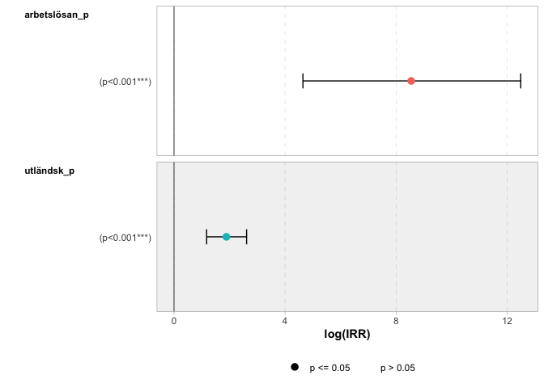<!-- -->

``` r
ggcoef_model(model.nbrm1e, variable_labels = c(
  arbetslösan_p   = "Share unemployed",
  utländsk_p = "Share foreign background",
  youth_p = "Share aged 15-24",
  Rate.crime="Burglary rate in 2020",
  pop_dens="Persons per km2",
  is.in = "Vulnerable area",
  isolation_utl = "Segregation",
  is.in.demo = "Quran burning demo"),
  no_reference_row = broom.helpers::all_dichotomous(), show_p_values = FALSE,
  signif_stars =FALSE) +
  labs(title="Negative binomial", x = "Coefficients")
```

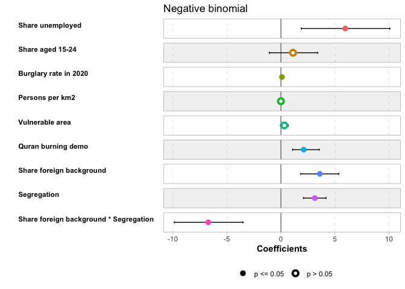<!-- -->

``` r
ggpredict(model.nbrm1e, terms="is.in", condition = c(totalt_age = median(database$totalt_age)))
```

    ## # Predicted counts of dv
    ## 
    ## is.in | Predicted |     95% CI
    ## ------------------------------
    ##     0 |      0.30 | 0.27, 0.33
    ##     1 |      0.41 | 0.28, 0.58
    ## 
    ## Adjusted for:
    ## * arbetslösan_p =    0.04
    ## *       youth_p =    0.11
    ## *    Rate.crime =    4.58
    ## *      pop_dens = 3356.92
    ## *    is.in.demo =    0.00
    ## *   utländsk_p =    0.26
    ## * isolation_utl =    0.35

``` r
ggpredict(model.nbrm1e, terms="arbetslösan_p", condition = c(totalt_age = median(database$totalt_age)))
```

    ## # Predicted counts of dv
    ## 
    ## arbetslösan_p | Predicted |     95% CI
    ## --------------------------------------
    ##          0.00 |      0.24 | 0.20, 0.29
    ##          0.10 |      0.44 | 0.34, 0.57
    ##          0.20 |      0.80 | 0.43, 1.51
    ##          0.30 |      1.46 | 0.53, 4.02
    ## 
    ## Adjusted for:
    ## *       youth_p =    0.11
    ## *    Rate.crime =    4.58
    ## *      pop_dens = 3356.92
    ## *         is.in =    0.08
    ## *    is.in.demo =    0.00
    ## *   utländsk_p =    0.26
    ## * isolation_utl =    0.35

``` r
ggpredict(model.nbrm1e, terms="utländsk_p", condition = c(totalt_age = median(database$totalt_age)))
```

    ## # Predicted counts of dv
    ## 
    ## utländsk_p | Predicted |     95% CI
    ## -----------------------------------
    ##       0.00 |      0.22 | 0.18, 0.28
    ##       0.20 |      0.28 | 0.26, 0.31
    ##       0.40 |      0.36 | 0.31, 0.43
    ##       0.60 |      0.46 | 0.33, 0.65
    ##       0.80 |      0.59 | 0.36, 1.00
    ##       1.00 |      0.76 | 0.38, 1.52
    ## 
    ## Adjusted for:
    ## * arbetslösan_p =    0.04
    ## *       youth_p =    0.11
    ## *    Rate.crime =    4.58
    ## *      pop_dens = 3356.92
    ## *         is.in =    0.08
    ## *    is.in.demo =    0.00
    ## * isolation_utl =    0.35

``` r
ggpredict(model.nbrm1e, terms="isolation_utl", condition = c(totalt_age = median(database$totalt_age)))
```

    ## # Predicted counts of dv
    ## 
    ## isolation_utl | Predicted |     95% CI
    ## --------------------------------------
    ##          0.00 |      0.19 | 0.14, 0.25
    ##          0.50 |      0.38 | 0.33, 0.43
    ##          1.00 |      0.76 | 0.48, 1.20
    ## 
    ## Adjusted for:
    ## * arbetslösan_p =    0.04
    ## *       youth_p =    0.11
    ## *    Rate.crime =    4.58
    ## *      pop_dens = 3356.92
    ## *         is.in =    0.08
    ## *    is.in.demo =    0.00
    ## *   utländsk_p =    0.26

``` r
ggpredict(model.nbrm1e, terms="Rate.crime", condition = c(totalt_age = median(database$totalt_age)))
```

    ## # Predicted counts of dv
    ## 
    ## Rate.crime | Predicted |        95% CI
    ## --------------------------------------
    ##          0 |      0.20 |  0.17,   0.23
    ##         10 |      0.51 |  0.45,   0.58
    ##         20 |      1.30 |  0.98,   1.73
    ##         30 |      3.35 |  2.11,   5.31
    ##         40 |      8.60 |  4.54,  16.32
    ##         50 |     22.09 |  9.72,  50.21
    ##         60 |     56.72 | 20.81, 154.58
    ## 
    ## Adjusted for:
    ## * arbetslösan_p =    0.04
    ## *       youth_p =    0.11
    ## *      pop_dens = 3356.92
    ## *         is.in =    0.08
    ## *    is.in.demo =    0.00
    ## *   utländsk_p =    0.26
    ## * isolation_utl =    0.35

``` r
ggpredict(model.nbrm1e, terms="pop_dens", condition = c(totalt_age = median(database$totalt_age)))
```

    ## # Predicted counts of dv
    ## 
    ## pop_dens | Predicted |     95% CI
    ## ---------------------------------
    ##        0 |      0.29 | 0.26, 0.32
    ##     8000 |      0.32 | 0.29, 0.36
    ##    14000 |      0.35 | 0.29, 0.41
    ##    22000 |      0.38 | 0.29, 0.50
    ##    30000 |      0.42 | 0.29, 0.60
    ##    36000 |      0.45 | 0.29, 0.70
    ##    44000 |      0.50 | 0.29, 0.86
    ##    58000 |      0.59 | 0.29, 1.22
    ## 
    ## Adjusted for:
    ## * arbetslösan_p = 0.04
    ## *       youth_p = 0.11
    ## *    Rate.crime = 4.58
    ## *         is.in = 0.08
    ## *    is.in.demo = 0.00
    ## *   utländsk_p = 0.26
    ## * isolation_utl = 0.35

    ## 
    ## Not all rows are shown in the output. Use `print(..., n = Inf)` to show
    ##   all rows.

``` r
ggpredict(model.nbrm1e, terms="is.in.demo", condition = c(totalt_age = median(database$totalt_age)))
```

    ## # Predicted counts of dv
    ## 
    ## is.in.demo | Predicted |     95% CI
    ## -----------------------------------
    ##          0 |      0.30 | 0.28, 0.33
    ##          1 |      2.49 | 0.76, 8.12
    ## 
    ## Adjusted for:
    ## * arbetslösan_p =    0.04
    ## *       youth_p =    0.11
    ## *    Rate.crime =    4.58
    ## *      pop_dens = 3356.92
    ## *         is.in =    0.08
    ## *   utländsk_p =    0.26
    ## * isolation_utl =    0.35

#### Predicted events by vulnerable area

Finally we can present predicted counts for variables of interest when
other variables are set to their modes. There is no statistically
significant difference in the number of riot events between
neighbouhroods that fall into vulnerable areas and those that don’t.

``` r
ggpredict(model.nbrm1e, terms="is.in", condition = c(totalt_age = median(database$totalt_age))) %>%
  ggplot(aes(x=as_factor(x), y=predicted)) +
  geom_pointrange(aes(ymin=conf.low, ymax=conf.high)) + 
  labs(title="Predicted events", x = "Vulnerable area", y = "Count") +
  theme_bw()
```

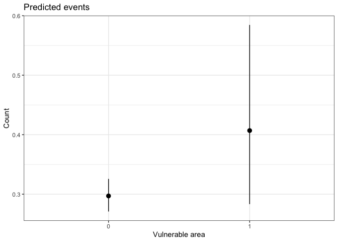<!-- -->

#### Predicted events by demo

Predicted events for whether neighborhood had a permit for Quran burning
demonstration (both those that were later revoked and not).
Neighbourhoods with a permit had higher number of predicted riot related
crimes.

``` r
ggpredict(model.nbrm1e, terms="is.in.demo", condition = c(totalt_age = median(database$totalt_age))) %>%
  ggplot(aes(x=as_factor(x), y=predicted)) +
  geom_pointrange(aes(ymin=conf.low, ymax=conf.high)) + 
  labs(title="Predicted events", x = "Quran burning demo", y = "Count") +
  theme_bw()
```

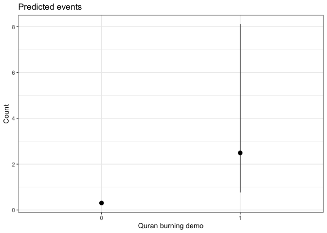<!-- -->

#### Predicted events by share unemployed

With q1 and 13 in red dashed lines and median in solid red line.

``` r
m<-median(database$arbetslösan_p)
q1 <- quantile(database$arbetslösan_p, 0.25, na.rm = TRUE) 
q3 <- quantile(database$arbetslösan_p, 0.75, na.rm = TRUE) 

ggpredict(model.nbrm1e, terms="arbetslösan_p", condition = c(totalt_age = median(database$totalt_age))) %>%
  ggplot(aes(x=x, y=predicted)) +                                      
  geom_line() + 
  geom_ribbon(aes(ymin=conf.low, ymax=conf.high), alpha=0.1, fill = "steelblue") +
  geom_vline(xintercept=m, 
             color = "red") +
  geom_vline(xintercept=q1, linetype="dashed",
             color = "red") +
  geom_vline(xintercept=q3, linetype="dashed",
             color = "red") +
  labs(title="Predicted events", x = "Share unemployed", y = "Count") +
  theme_bw()
```

<!-- -->

#### Predicted events by share foreign background

With q1 and 13 in red dashed lines and median in solid red line.

``` r
m<-median(database$utländsk_p)
q1 <- quantile(database$utländsk_p, 0.25, na.rm = TRUE) 
q3 <- quantile(database$utländsk_p, 0.75, na.rm = TRUE) 

ggpredict(model.nbrm1e, terms="utländsk_p", condition = c(totalt_age = median(database$totalt_age))) %>%
  ggplot(aes(x=x, y=predicted)) +                                      
  geom_line() + 
  geom_ribbon(aes(ymin=conf.low, ymax=conf.high), alpha=0.1, fill = "steelblue") +
  geom_vline(xintercept=m, 
             color = "red") +
  geom_vline(xintercept=q1, linetype="dashed",
             color = "red") +
  geom_vline(xintercept=q3, linetype="dashed",
             color = "red") +
  labs(title="Predicted events", x = "Share foreign background", y = "Count") +
  theme_bw()
```

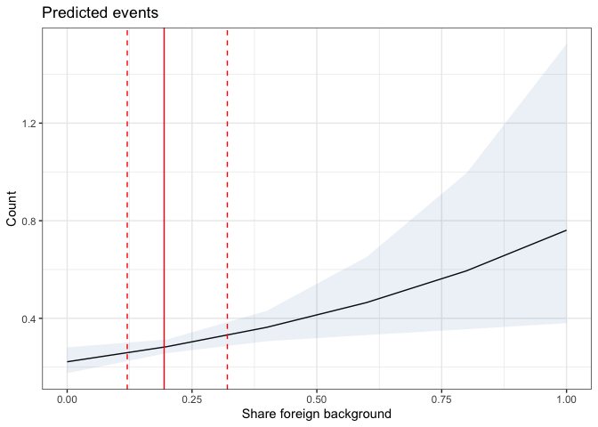<!-- -->

#### Predicted events by share youth

With q1 and 13 in red dashed lines and median in solid red line.

``` r
m<-median(database$youth_p)
q1 <- quantile(database$youth_p, 0.25, na.rm = TRUE) 
q3 <- quantile(database$youth_p, 0.75, na.rm = TRUE) 

ggpredict(model.nbrm1e, terms="youth_p", condition = c(totalt_age = median(database$totalt_age))) %>%
  ggplot(aes(x=x, y=predicted)) +                                      
  geom_line() + 
  geom_ribbon(aes(ymin=conf.low, ymax=conf.high), alpha=0.1, fill = "steelblue") +
  geom_vline(xintercept=m, 
             color = "red") +
  geom_vline(xintercept=q1, linetype="dashed",
             color = "red") +
  geom_vline(xintercept=q3, linetype="dashed",
             color = "red") +
  labs(title="Predicted events", x = "Share youth", y = "Count") +
  theme_bw()
```

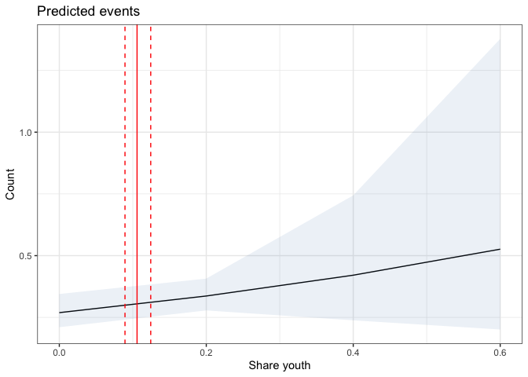<!-- -->

#### Predicted events by population density

With q1 and 13 in red dashed lines and median in solid red line.

``` r
m<-median(database$pop_dens)
q1 <- quantile(database$pop_dens, 0.25, na.rm = TRUE) 
q3 <- quantile(database$pop_dens, 0.75, na.rm = TRUE) 

ggpredict(model.nbrm1e, terms="pop_dens", condition = c(totalt_age = median(database$totalt_age))) %>%
  ggplot(aes(x=x, y=predicted)) +                                      
  geom_line() + 
  geom_ribbon(aes(ymin=conf.low, ymax=conf.high), alpha=0.1, fill = "steelblue") +
  geom_vline(xintercept=m, 
             color = "red") +
  geom_vline(xintercept=q1, linetype="dashed",
             color = "red") +
  geom_vline(xintercept=q3, linetype="dashed",
             color = "red") +
  labs(title="Predicted events", x = "Population density (persons/km2)", y = "Count") +
  theme_bw()
```

<!-- -->

#### Predicted events by 2020 levels of bulglary

With q1 and 13 in red dashed lines and median in solid red line.

``` r
m<-median(database$Rate.crime)
q1 <- quantile(database$Rate.crime, 0.25, na.rm = TRUE) 
q3 <- quantile(database$Rate.crime, 0.75, na.rm = TRUE) 

ggpredict(model.nbrm1e, terms="Rate.crime", condition = c(totalt_age = median(database$totalt_age))) %>%
  ggplot(aes(x=x, y=predicted)) +                                      
  geom_line() + 
  geom_ribbon(aes(ymin=conf.low, ymax=conf.high), alpha=0.1, fill = "steelblue") +
  geom_vline(xintercept=m, 
             color = "red") +
  geom_vline(xintercept=q1, linetype="dashed",
             color = "red") +
  geom_vline(xintercept=q3, linetype="dashed",
             color = "red") +
  labs(title="Predicted events", x = "Rate bulglary in 2020", y = "Count") +
  theme_bw()
```

<!-- -->

#### Conclusions
